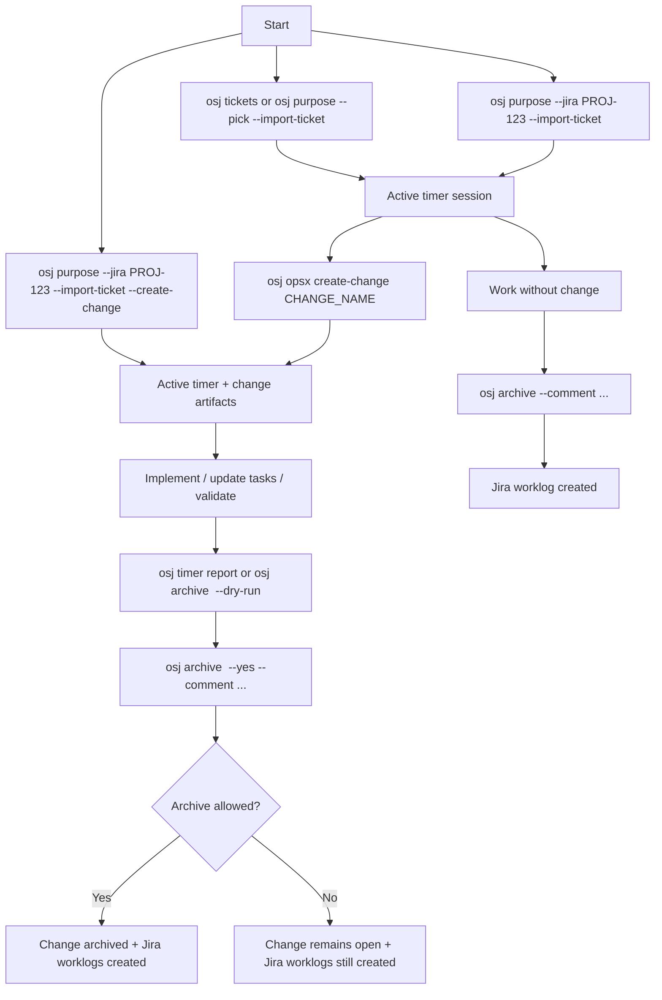
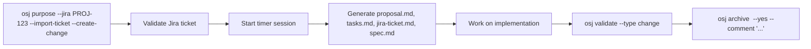
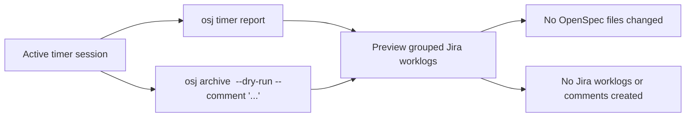
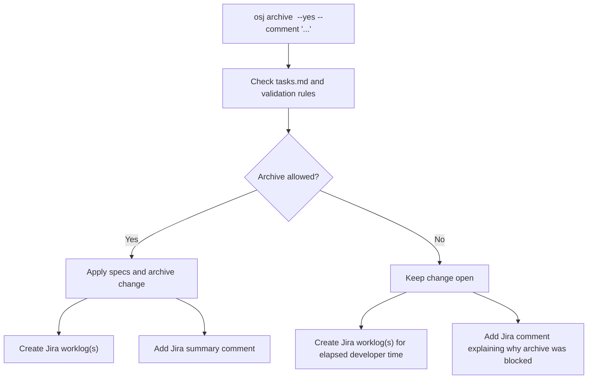

<p align="center">
  <a href="https://github.com/embrana/AutomateIA">
    <picture>
      <source srcset="assets/openspec_bg.png">
      
    </picture>
  </a>
</p>

<p align="center">
  <a href="https://github.com/embrana/AutomateIA/actions/workflows/ci.yml"></a>
  <a href="https://www.npmjs.com/package/@fission-ai/openspec"></a>
  <a href="./LICENSE"></a>
  <a href="https://discord.gg/YctCnvvshC"></a>
</p>

<details>
<summary><strong>The most loved spec framework.</strong></summary>

[](https://github.com/embrana/AutomateIA/stargazers)
[](https://www.npmjs.com/package/@fission-ai/openspec)
[](https://github.com/embrana/AutomateIA/graphs/contributors)

</details>
<p></p>

> [!IMPORTANT]
> This repository is a modified OpenSpec framework fork. It extends the upstream workflow with the `osj` Jira/Tempo runtime, OPSX session governance, agentic delivery orchestration, and local operations monitoring surfaces.

Our philosophy:

```text
→ fluid not rigid
→ iterative not waterfall
→ easy not complex
→ built for brownfield not just greenfield
→ scalable from personal projects to enterprises
```

> [!TIP]
> **New workflow now available!** We've rebuilt OpenSpec with a new artifact-guided workflow.
>
> Run `/opsx:propose "your idea"` to get started. In Codex-style tools this usually appears as `/opsx-propose`. → [Learn more here](docs/opsx.md)

<p align="center">
  Follow <a href="https://x.com/0xTab">@0xTab on X</a> for updates · Join the <a href="https://discord.gg/YctCnvvshC">OpenSpec Discord</a> for help and questions.
</p>

<!-- TODO: Add GIF demo of /opsx:propose → /opsx:archive workflow -->

## See it in action

```text
You: /opsx:propose add-dark-mode
AI:  Created openspec/changes/add-dark-mode/
     ✓ proposal.md — why we're doing this, what's changing
     ✓ specs/       — requirements and scenarios
     ✓ design.md    — technical approach
     ✓ tasks.md     — implementation checklist
     Ready for implementation!

You: /opsx:apply
AI:  Implementing tasks...
     ✓ 1.1 Add theme context provider
     ✓ 1.2 Create toggle component
     ✓ 2.1 Add CSS variables
     ✓ 2.2 Wire up localStorage
     All tasks complete!

You: /opsx:archive
AI:  Archived to openspec/changes/archive/2025-01-23-add-dark-mode/
     Specs updated. Ready for the next feature.
```

<details>
<summary><strong>OpenSpec Dashboard</strong></summary>

<p align="center">
  
</p>

</details>

## Quick Start

**Requires Node.js 20.19.0 or higher.**

Install OpenSpec globally:

```bash
npm install -g @fission-ai/openspec@latest
```

Then navigate to your project directory and initialize:

```bash
cd your-project
openspec init
```

Now tell your AI: `/opsx:propose <what-you-want-to-build>`

If you're using the Jira/Tempo workflow in this fork and already have an active `osj` session, `/opsx:explore` and `/opsx:propose` now reuse the imported Jira ticket context and enforce native timer block tracking through `osj opsx ...` helpers.

If you want the expanded workflow (`/opsx:new`, `/opsx:continue`, `/opsx:ff`, `/opsx:verify`, `/opsx:sync`, `/opsx:bulk-archive`, `/opsx:onboard`), select it with `openspec config profile` and apply with `openspec update`.

> [!NOTE]
> Not sure if your tool is supported? [View the full list](docs/supported-tools.md) – we support 25+ tools and growing.
>
> Also works with pnpm, yarn, bun, and nix. [See installation options](docs/installation.md).

## Jira / Tempo Worklog Tracking

This fork installs a separate CLI named `osj` so it can live alongside the official `openspec` package without one overwriting the other. The older `openspec-jira` alias still works for backward compatibility, but `osj` is the recommended command.

OpenSpec can:

- import Jira ticket context,
- create OpenSpec change artifacts from Jira,
- track local work time,
- split work into granular time blocks,
- and create Jira Cloud worklogs when you close the session.

Tempo Timesheets reflects those Jira worklogs inside the Jira/Tempo UI because the integration writes to Jira's native worklog API.

### Install And Configure

Install this fork:

```bash
npm install -g git+ssh://git@github.com/embrana/AutomateIA.git
```

Or from a local clone:

```bash
npm install
npm run build
npm install -g .
```

Configure Jira once per developer machine:

```bash
osj config set jira.base_url https://your-company.atlassian.net
osj config set jira.email dev@example.com
osj config set jira.api_token YOUR_ATLASSIAN_API_TOKEN
osj config set jira.default_project PROJ
osj config set worklog.rounding minute
osj config set worklog.min_seconds 60
osj config show
```

Useful helpers:

```bash
osj --help
osj hlp
osj hlp --short
osj hlp --demo
osj tickets
```

Required Jira permissions:

```text
Browse Projects
Work on Issues
Add comments
```

`Add comments` is only needed to write the OpenSpec archive summary back to the Jira ticket. If it is missing, the worklog can still be created.

### OPSX-Aware Jira Sessions

When an `osj` session is active, the OPSX workflows are no longer prompt-only. OpenSpec now exposes native helpers that the generated `/opsx:explore` and `/opsx:propose` prompts can call:

```bash
osj opsx track explore --json
osj opsx track propose discovery --json
osj opsx create-change <change-name>
osj opsx track propose generation
osj opsx track propose review
```

These helpers add three important guarantees:

- imported Jira ticket context becomes the primary context for OPSX exploration/proposal work;
- timer blocks switch natively between `human_agent_interaction / spec` and `ai_autonomous / spec`;
- change creation becomes session-aware and attaches the created change back to the active `osj` session.

### Flow Map



### Flow 1: Start A Session Without Creating A Change

Use this when the change already exists, or when you want to track time first and decide later whether you need OpenSpec artifacts.


Equivalent known-ticket command:

```bash
osj purpose --jira PROJ-123 --import-ticket
```

With `--import-ticket`, OpenSpec stores this in the active session:

```text
key
summary
status
assignee
description_text
url
```

### Flow 2: Start A Session And Create The Change Immediately

Use this when you already know you want the full OpenSpec flow from the start.



Artifacts created:

```text
openspec/changes/<change-name>/proposal.md
openspec/changes/<change-name>/tasks.md
openspec/changes/<change-name>/jira-ticket.md
openspec/changes/<change-name>/specs/<change-name>/spec.md
```

### Flow 3: Start The Session First, Then Create The Change With OPSX Governance

This is the flow for: "I chose the ticket, I started working, and now I want OpenSpec artifacts."

```mermaid
flowchart LR
    A["osj purpose --pick --import-ticket"] --> B["Active timer session"]
    B --> C["Work a bit"]
    C --> D["osj opsx track propose discovery --json"]
    D --> E["Switch to human_agent_interaction / spec"]
    E --> F["osj opsx create-change CHANGE_NAME"]
    F --> G["Reuse Jira ticket from active session"]
    G --> H["Switch to ai_autonomous / spec during change generation"]
    H --> I["Attach created change to active session"]
    I --> J["osj opsx track propose review"]
    J --> K["Return to human_agent_interaction / spec for review"]
```



Low-level/manual fallbacks still exist when you do not want the native OPSX helper:

```bash
osj new change --from-session
```

You can also still create artifacts from a specific issue key without using the active session:

```bash
osj new change --from-ticket PROJ-123
```

### Flow 4: Preview Before Closing

Use this when you want to see exactly what Jira worklogs OpenSpec is about to create.



Useful commands:

```bash
osj timer status
osj timer status --blocks
osj timer report
osj archive <change-name> --dry-run --comment "Implementation session"
```

### Flow 5: Archive Outcomes

There are two important archive outcomes now:

1. the change can be archived successfully;
2. the change can be blocked, but the developer time is still written to Jira.



Important rule:

```text
Incomplete tasks in tasks.md block the OpenSpec archive.
They do not block Jira worklog creation.
```

That means a developer can still log real time spent, even when the OpenSpec change is not ready to close.

### Flow 6: Granular Time Blocks

This workflow supports granular worklog segmentation for the same Jira ticket. OPSX now participates in that segmentation too.

```mermaid
flowchart LR
    A["Active Jira session"] --> B["human / implementation"]
    B --> C["osj opsx track explore --json"]
    C --> D["human_agent_interaction / spec"]
    D --> E["osj opsx track propose generation"]
    E --> F["ai_autonomous / spec"]
    F --> G["osj timer bugfix --description 'Fix validation errors'"]
    G --> H["human / bugfix"]
    H --> I["osj archive ..."]
    I --> J["Create one Jira worklog per grouped block"]
```



Commands for block control:

```bash
osj opsx track explore --json
osj opsx track propose discovery --json
osj opsx track propose generation
osj opsx track propose review
osj timer pause
osj timer resume
osj timer switch --mode human --kind bugfix --description "Fix validation errors"
osj timer bugfix --description "Fix OpenSpec validation errors"
osj timer start --jira PROJ-123 --description "Manual IDE work"
osj timer cancel
```

### Command Map

Use this as the shortest command guide:

```text
Find a ticket:
  osj tickets

Start timer from a picked ticket:
  osj purpose --pick --import-ticket

Start timer and create artifacts:
  osj purpose --pick --import-ticket --create-change
  osj purpose --jira PROJ-123 --import-ticket --create-change

Create artifacts later from the active session with native OPSX tracking:
  osj opsx track propose discovery --json
  osj opsx create-change <change-name>
  osj opsx track propose generation
  osj opsx track propose review

Low-level/manual fallback:
  osj new change --from-session

Preview worklogs:
  osj ticket show
  osj timer report
  osj archive <change-name> --dry-run --comment "Implementation session"

Archive successfully:
  osj archive <change-name> --yes --comment "Implementation session"

Close only the timer session, no change archive:
  osj archive --comment "Implementation session"

Retry failed sync:
  osj archive --retry
```

### Where Data Is Stored

OpenSpec stores:

```text
.openspec/session.json
  active timer session

.openspec/sessions/
  closed local timer metadata

openspec/changes/<change-name>/
  change artifacts before archive

openspec/changes/archive/
  archived OpenSpec changes
```

Jira credentials are stored in the user's global OpenSpec config, normally:

```text
~/.config/openspec/config.json
```

Avoid committing API tokens to a project repository.

### Structured Jira Descriptions

When the Jira description contains structured SDD sections such as:

```text
## Acceptance Criteria
## Business Rules
## Domain / Data / Integration Contracts
## UX / Error States
## Out of Scope
```

OpenSpec uses those sections to create a richer delta spec. Acceptance criteria headings like `### CA-1 — ...` become OpenSpec scenarios.

### Sandbox Demo

To run a local sandbox version without real Jira credentials:

```bash
npm run demo:jira
```

The generated demo workspace is written to `demo-output/jira-happy-path/` so you can inspect the created OpenSpec change, archived specs, session metadata, and mock Jira worklog payload.

The values `https://your-company.atlassian.net`, `dev@example.com`, `YOUR_ATLASSIAN_API_TOKEN`, and `PROJ-123` are examples for the real Jira flow. Replace them with real Jira values, or use `npm run demo:jira` for the sandbox path.

See the full terminal reference in [CLI](docs/cli.md) and the full walkthrough in [Jira / Tempo Happy Path Demo](docs/demo-jira-tempo-happy-path.md).

## Docs

→ **[Getting Started](docs/getting-started.md)**: first steps<br>
→ **[Workflows](docs/workflows.md)**: combos and patterns<br>
→ **[Commands](docs/commands.md)**: slash commands & skills<br>
→ **[CLI](docs/cli.md)**: terminal reference<br>
→ **[Jira / Tempo Happy Path Demo](docs/demo-jira-tempo-happy-path.md)**: end-to-end demo flow<br>
→ **[Supported Tools](docs/supported-tools.md)**: tool integrations & install paths<br>
→ **[Concepts](docs/concepts.md)**: how it all fits<br>
→ **[Multi-Language](docs/multi-language.md)**: multi-language support<br>
→ **[Customization](docs/customization.md)**: make it yours


## Why OpenSpec?

AI coding assistants are powerful but unpredictable when requirements live only in chat history. OpenSpec adds a lightweight spec layer so you agree on what to build before any code is written.

- **Agree before you build** — human and AI align on specs before code gets written
- **Stay organized** — each change gets its own folder with proposal, specs, design, and tasks
- **Work fluidly** — update any artifact anytime, no rigid phase gates
- **Use your tools** — works with 20+ AI assistants via slash commands

### How we compare

**vs. [Spec Kit](https://github.com/github/spec-kit)** (GitHub) — Thorough but heavyweight. Rigid phase gates, lots of Markdown, Python setup. OpenSpec is lighter and lets you iterate freely.

**vs. [Kiro](https://kiro.dev)** (AWS) — Powerful but you're locked into their IDE and limited to Claude models. OpenSpec works with the tools you already use.

**vs. nothing** — AI coding without specs means vague prompts and unpredictable results. OpenSpec brings predictability without the ceremony.

## Updating OpenSpec

**Upgrade the package**

```bash
npm install -g @fission-ai/openspec@latest
```

**Refresh agent instructions**

Run this inside each project to regenerate AI guidance and ensure the latest slash commands are active:

```bash
openspec update
```

## Usage Notes

**Model selection**: OpenSpec works best with high-reasoning models. We recommend Opus 4.5 and GPT 5.2 for both planning and implementation.

**Context hygiene**: OpenSpec benefits from a clean context window. Clear your context before starting implementation and maintain good context hygiene throughout your session.

## Contributing

**Small fixes** — Bug fixes, typo corrections, and minor improvements can be submitted directly as PRs.

**Larger changes** — For new features, significant refactors, or architectural changes, please submit an OpenSpec change proposal first so we can align on intent and goals before implementation begins.

When writing proposals, keep the OpenSpec philosophy in mind: we serve a wide variety of users across different coding agents, models, and use cases. Changes should work well for everyone.

**AI-generated code is welcome** — as long as it's been tested and verified. PRs containing AI-generated code should mention the coding agent and model used (e.g., "Generated with Claude Code using claude-opus-4-5-20251101").

### Development

- Install dependencies: `pnpm install`
- Build: `pnpm run build`
- Test: `pnpm test`
- Develop CLI locally: `pnpm run dev` or `pnpm run dev:cli`
- Conventional commits (one-line): `type(scope): subject`

## Other

<details>
<summary><strong>Telemetry</strong></summary>

OpenSpec collects anonymous usage stats.

We collect only command names and version to understand usage patterns. No arguments, paths, content, or PII. Automatically disabled in CI.

**Opt-out:** `export OPENSPEC_TELEMETRY=0` or `export DO_NOT_TRACK=1`

</details>

<details>
<summary><strong>Maintainers & Advisors</strong></summary>

See [MAINTAINERS.md](MAINTAINERS.md) for the list of core maintainers and advisors who help guide the project.

</details>


## License

MIT
