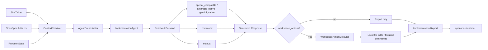
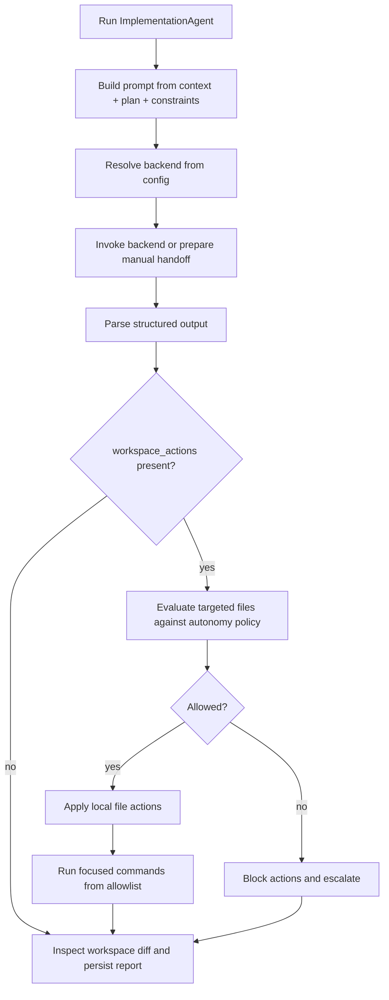

# Agent Backends And Connectivity

See also: [ARCHITECTURE](./ARCHITECTURE.md), [AGENT-CONTRACTS](./AGENT-CONTRACTS.md), [CURRENT-IMPLEMENTATION](./CURRENT-IMPLEMENTATION.md)

## Purpose

This document explains how runtime agents connect to external execution backends. The design rule is simple: agents should not be hardcoded to one vendor or one transport.

The runtime resolves a backend per agent through config, so the same orchestration model can work with:

- hosted LLM APIs
- local OpenAI-compatible gateways
- Anthropic Claude native API
- Gemini native API
- local command runners that can edit the workspace
- manual handoff mode for draft prompts

The important implementation detail after PR 7 is that backend connectivity and local workspace effects are now separate concerns:

- a backend can reason and return structured output
- the runtime can optionally apply runtime-controlled `workspace_actions` in the local repo

## Execution Model

### Data Flow



### Control Flow



## Backend Modes

### `openai_compatible`

Use this when the target exposes a chat-completions API compatible with the OpenAI request shape.

Fields:

- `base_url`
- `model`
- `request_path` optional
- `api_key` optional
- `api_key_env` optional
- `headers` optional
- `timeout_ms` optional

Best for:

- hosted gateways
- self-hosted OpenAI-compatible servers
- API-driven reasoning agents

Important nuance:

- this mode can now drive local repo edits if the backend returns valid `workspace_actions` and those actions pass runtime policy
- it can also still rely on external tool/workspace access if the service behind it already has its own tool runtime

### `command`

Use this when the backend is a local executable or wrapper command.

Fields:

- `command`
- `args` optional
- `env` optional
- `timeout_ms` optional

Best for:

- local agent runners
- Codex-style wrappers
- internal tools that already know how to patch files in the workspace

Runtime behavior:

- the runtime sends JSON to stdin
- the command runs in the project workspace
- stdout is parsed as JSON when possible
- the command can either patch files by itself or return `workspace_actions` for the runtime to apply

### `anthropic_native`

Use this when you want to call Anthropic directly through the Messages API.

Fields:

- `model`
- `api_key` or `api_key_env`
- `anthropic_version` optional, defaults to `2023-06-01`
- `base_url` optional
- `request_path` optional
- `max_tokens` optional
- `temperature` optional
- `timeout_ms` optional

Best for:

- direct Claude integration without a proxy
- keeping Anthropic auth and request shape explicit

### `gemini_native`

Use this when you want to call Gemini directly.

This adapter supports two transports:

- `developer_api`
- `vertex`

Common fields:

- `model`
- `base_url` optional
- `request_path` optional
- `api_version` optional
- `max_tokens` optional
- `temperature` optional
- `timeout_ms` optional

For `developer_api`:

- `api_key` or `api_key_env`
- `gemini_transport: "developer_api"` optional if auto-detected

For `vertex`:

- `access_token` or `access_token_env`
- `project`
- `location`
- `publisher` optional, defaults to `google`
- `gemini_transport: "vertex"` recommended
- `gemini_vertex_auth` optional:
  - `auto`
  - `access_token`
  - `gcloud_adc`
  - `gcloud_cli`
- `gcloud_bin` optional, defaults to `gcloud`

### `manual`

Use this when you want prompt artifacts and structured handoff but no live model call.

Best for:

- operator-supervised flows
- debugging prompts before wiring a real backend
- copy/paste handoff into another tool

Runtime behavior:

- the runtime writes prompt/request artifacts
- no backend invocation happens

## Config Shape

```json
{
  "agents": {
    "default_backend": "shared",
    "routing": {
      "implementation": "code-runner",
      "critic": "shared",
      "delivery": "shared"
    },
    "backends": {
      "shared": {
        "mode": "openai_compatible",
        "base_url": "https://gateway.example.com",
        "model": "gpt-5.4-mini",
        "api_key_env": "OPENAI_API_KEY"
      },
      "code-runner": {
        "mode": "command",
        "command": "/usr/local/bin/my-agent-runner",
        "args": ["implementation"]
      }
    }
  }
}
```

Resolution rules:

1. the runtime checks `agents.routing.<agent-role>`
2. if that route is missing, it falls back to `agents.default_backend`
3. it resolves the named entry from `agents.backends`
4. the backend mode determines how invocation happens

Current routable roles:

- `context`
- `spec`
- `planning`
- `implementation`
- `critic`
- `validation`
- `delivery`

## What Is Implemented Today

The shared backend registry is implemented now, and `ImplementationAgent` already uses it.

Supported modes today:

- `manual`
- `openai_compatible`
- `command`
- `anthropic_native`
- `gemini_native`

`ImplementationAgent` now:

1. builds a structured prompt from context, plan, and constraints
2. resolves a configured backend
3. invokes it or prepares a manual handoff
4. parses structured backend output
5. applies backend-proposed `workspace_actions` locally when policy allows
6. inspects the actual workspace diff afterward
7. persists:
   - `change-report.json`
   - `change-report.md`
   - `backend-prompt.md` when present
   - `backend-request.json` when present
   - `backend-response.json` when present

## Workspace Actions Contract

Any backend mode can ask the runtime to perform bounded local actions by returning `workspace_actions` inside `structured_output`.

Example backend response:

```json
{
  "status": "applied",
  "summary": "Updated runtime worker and added a focused test.",
  "files_touched": [
    "src/runtime-worker.mjs",
    "test/runtime-worker.test.mjs"
  ],
  "tests_added": [
    "test/runtime-worker.test.mjs"
  ],
  "limitations": [],
  "human_questions": [],
  "workspace_actions": [
    {
      "type": "replace_in_file",
      "path": "src/runtime-worker.mjs",
      "old": "export const runtimeWorker = false;\n",
      "new": "export const runtimeWorker = true;\n"
    },
    {
      "type": "write_file",
      "path": "test/runtime-worker.test.mjs",
      "content": "import test from 'node:test';\n..."
    },
    {
      "type": "run_command",
      "command": ["node", "--test", "test/runtime-worker.test.mjs"],
      "reason": "Run focused runtime worker test"
    }
  ]
}
```

Supported action types today:

- `write_file`
- `replace_in_file`
- `delete_file`
- `run_command`

Guardrails enforced by the runtime:

- actions are resolved relative to the project root only
- writes to `.git/**` are blocked
- writes to `.openspec/runtime/**` are blocked
- writes to `openspec/changes/<active-change>/**` are blocked for `ImplementationAgent`
- `run_command` is allowlisted to focused verification commands such as:
  - `node --test ...`
  - `pnpm exec vitest ...`
  - `pnpm exec tsc ...`
  - `pnpm test`
  - `npm test`
  - `yarn test`
- the targeted files are evaluated against autonomy policy before execution

## How The Other Agents Connect

They do not have to connect only “by API”.

The intended model is:

- deterministic/local logic first
- backend invocation only where it materially improves output
- the same backend registry reused across agents

That means the other agents can connect through:

- API mode
- command mode
- manual mode

Current status:

- `ContextAgent`, `SpecAgent`, `PlanningAgent`, `CriticAgent`, `ValidationAgent`, and `DeliveryAgent` still use local deterministic logic today
- the shared backend abstraction is already ready for them

## Recommendations

### Best first step

Use `manual`.

That gives:

- traceability
- prompt artifacts
- no vendor lock-in

### Best path for real local code editing

Use `command`.

That gives:

- local filesystem access
- no dependency on one HTTP API
- easy integration with internal runners

Example in this repository:

- [scripts/codex-implementation-runner.mjs](/Users/pm-ebrana/Documents/Replace/OpenSpec/scripts/codex-implementation-runner.mjs)

### Best path for hosted reasoning plus runtime-controlled local edits

Use `openai_compatible`, `anthropic_native`, or `gemini_native` and have the backend return `workspace_actions`.

That gives:

- vendor flexibility
- local repo edits still governed by the runtime
- focused test execution without giving the remote API raw filesystem access

### Best path for hosted reasoning

Use `openai_compatible`.

That gives:

- `base_url + model + api_key` portability
- compatibility with many gateways
- one consistent request format

### Best path for Claude without a proxy

Use `anthropic_native`.

Example:

```json
{
  "agents": {
    "routing": {
      "implementation": "claude-direct",
      "critic": "claude-direct"
    },
    "backends": {
      "claude-direct": {
        "mode": "anthropic_native",
        "model": "claude-sonnet-4-20250514",
        "api_key_env": "ANTHROPIC_API_KEY"
      }
    }
  }
}
```

### Best path for Gemini Developer API

Use `gemini_native` with `developer_api`.

Example:

```json
{
  "agents": {
    "routing": {
      "implementation": "gemini-dev"
    },
    "backends": {
      "gemini-dev": {
        "mode": "gemini_native",
        "gemini_transport": "developer_api",
        "model": "gemini-2.5-flash",
        "api_key_env": "GEMINI_API_KEY"
      }
    }
  }
}
```

### Best path for Gemini on Vertex AI / GCP

Use `gemini_native` with `vertex`.

Example:

```json
{
  "agents": {
    "routing": {
      "implementation": "gemini-vertex"
    },
    "backends": {
      "gemini-vertex": {
        "mode": "gemini_native",
        "gemini_transport": "vertex",
        "gemini_vertex_auth": "auto",
        "model": "gemini-2.5-pro",
        "project": "my-gcp-project",
        "location": "us-central1"
      }
    }
  }
}
```

Vertex auth resolution order in `auto` mode:

1. `access_token` or `access_token_env`
2. `GOOGLE_OAUTH_ACCESS_TOKEN`
3. `gcloud auth application-default print-access-token`
4. `gcloud auth print-access-token`

That means Vertex is now usable without manually exporting a token, as long as the local machine is already authenticated with `gcloud`.

## Security Notes

- prefer `api_key_env` over inline `api_key`
- prefer `access_token_env` over inline `access_token`
- `osj config show` now redacts agent API keys and backend env values
- command backends run in the project workspace and should be treated as privileged
- runtime-applied `workspace_actions` are restricted to project-local paths and focused allowlisted commands

## Current Gaps

- only `ImplementationAgent` consumes the backend registry today
- there is no first-class `webhook` or `mcp_tool` backend mode yet
- backend failures still need richer runtime explanation in future `runtime explain` work

## Important Reality Check

Not every backend can edit your local repo.

Today, real autonomous local code edits require one of these:

- a `command` backend that actually patches files in the workspace
- any backend mode that returns valid `workspace_actions` for the runtime to apply locally
- an API/backend behind `openai_compatible`, `anthropic_native`, or `gemini_native` that itself has tool/workspace access through another runtime

If you point `anthropic_native` or `gemini_native` at a normal hosted API, the API call still does not magically rewrite local files by itself. The local repo only changes when:

- the backend returns `workspace_actions` and the runtime applies them
- or the backend service itself has its own tool/workspace runtime
