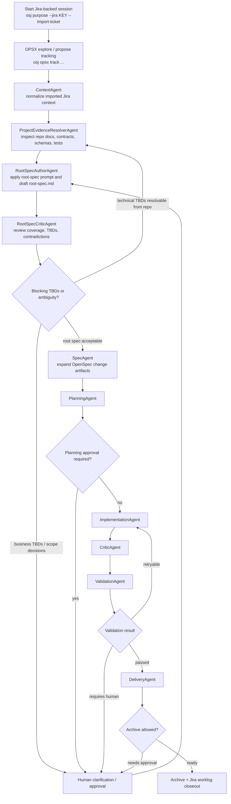
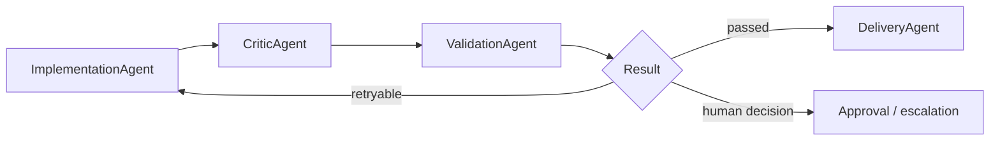

# Agentic Flow

See also: [CURRENT-IMPLEMENTATION](./CURRENT-IMPLEMENTATION.md), [ARCHITECTURE](./ARCHITECTURE.md), [STATE-MACHINES](./STATE-MACHINES.md), [AGENT-BACKENDS](./AGENT-BACKENDS.md), [AUTONOMY-POLICY](./AUTONOMY-POLICY.md), [ROOT-SPEC-PROMPT](./ROOT-SPEC-PROMPT.md), [ROOT-SPEC-RUNTIME-DESIGN](./ROOT-SPEC-RUNTIME-DESIGN.md)

## Purpose

This document explains the runtime as it is implemented today.

Its job is to show:

- how a Jira-backed work unit moves through the runtime
- where `opsx` fits into the lifecycle
- where the new root-spec prompt enters
- which artifacts are created before planning and code execution
- where approval gates interrupt progress

## Work Unit

The runtime executes one governed work unit:

```text
Work Unit = Jira Ticket + Session + Discovery Artifacts + Change + Execution Cycle
```

The important change in the current system is that the runtime no longer jumps directly from imported ticket context into OpenSpec change artifacts.

Instead, it now inserts a discovery layer that produces a root `spec.md` first.

## Current Stage Order

The current orchestrated order is:

1. `context_agent`
2. `project_evidence_resolver_agent`
3. `root_spec_author_agent`
4. `root_spec_critic_agent`
5. `spec_agent`
6. `planning_agent`
7. `implementation_agent`
8. `critic_agent`
9. `validation_agent`
10. `delivery_agent`

This means the runtime now follows:

```text
Imported Jira Ticket
-> Normalized Context
-> Project Evidence
-> Root Spec Draft
-> Root Spec Review
-> OpenSpec Change Artifacts
-> Planning
-> Implementation / Critic / Validation loop
-> Delivery
```

## Where The New Prompt Enters

The new prompt enters in the `root_spec_author_agent` stage.

Concretely:

- the embedded implementation source is `src/agents/root-spec/root-spec-prompt.ts`
- the human-readable mirrored documentation is [ROOT-SPEC-PROMPT](./ROOT-SPEC-PROMPT.md)
- the prompt is consumed by `RootSpecAuthorAgent`
- the author agent produces `root-spec.md` plus machine-readable metadata

The runtime injection point is:

```text
ContextAgent
-> ProjectEvidenceResolverAgent
-> RootSpecAuthorAgent  <-- prompt enters here
-> RootSpecCriticAgent
-> SpecAgent
```

Important nuance:

- the stored prompt in code is wrapped in a JSON-output contract
- the core business-analysis / SDD instructions remain the authoring contract for `spec_markdown`
- if a backend is configured, the runtime can persist the actual backend prompt/request/response artifacts under `.openspec/runtime/tickets/<ticket>/discovery/`

Relevant persisted files can include:

- `root-spec-backend-prompt.md`
- `root-spec-backend-request.json`
- `root-spec-backend-response.json`

## End-To-End Flow



## Runtime Stages

### 1. Session Start

Typical commands:

```bash
osj purpose --jira <KEY> --import-ticket
osj timer start --ticket <KEY>
```

What this does:

- opens or resumes a runtime-aware session
- imports Jira ticket context
- creates the runtime root under `.openspec/runtime/tickets/<ticket>/`

### 2. OPSX Bridge

Typical commands:

```bash
osj opsx track explore
osj opsx track propose discovery
osj opsx create-change <name>
osj opsx track propose generation
osj opsx track propose review
```

What this does:

- keeps `/opsx` workflows attached to the active Jira-backed session
- records the correct timer block semantics for discovery, generation, and review
- routes `osj opsx create-change <name>` through the root-spec flow when a live session exists

Important current behavior:

- in a session-aware flow, `osj opsx create-change <name>` no longer behaves like a blind scaffold step
- it persists `discovery/change-name-hint.json`
- then it orchestrates until `spec`

### 3. ContextAgent

Command:

```bash
osj agent run context
```

What it produces:

- normalized imported Jira context
- context summary artifacts

Current mode:

- deterministic

### 4. ProjectEvidenceResolverAgent

Command:

```bash
osj agent run project-evidence
```

What it produces:

- repository-driven evidence for technical TBD resolution
- impacted layers and candidate constraints

Artifacts:

- `.openspec/runtime/tickets/<ticket>/discovery/project-evidence.json`
- `.openspec/runtime/tickets/<ticket>/discovery/project-evidence.md`

Current mode:

- deterministic or backend-assisted depending on routing

### 5. RootSpecAuthorAgent

Command:

```bash
osj agent run root-spec
```

What it does:

- loads the embedded root-spec prompt
- combines imported Jira context with project evidence
- generates the root `spec.md`
- surfaces assumptions and open questions explicitly

Artifacts:

- `.openspec/runtime/tickets/<ticket>/discovery/root-spec.md`
- `.openspec/runtime/tickets/<ticket>/discovery/root-spec-metadata.json`

Prompt source:

- `src/agents/root-spec/root-spec-prompt.ts`

Reference documentation:

- [ROOT-SPEC-PROMPT](./ROOT-SPEC-PROMPT.md)

### 6. RootSpecCriticAgent

Command:

```bash
osj agent run root-spec-review
```

What it does:

- checks the root spec for missing coverage, contradictions, and unresolved TBDs
- decides whether the loop must:
  - go back to evidence resolution
  - go back to root spec authoring
  - stop for human clarification
  - continue to change artifact expansion

Artifacts:

- `.openspec/runtime/tickets/<ticket>/discovery/root-spec-review.json`
- `.openspec/runtime/tickets/<ticket>/discovery/root-spec-review.md`

### 7. SpecAgent

Command:

```bash
osj agent run spec
```

What it does now:

- expands the accepted root spec into OpenSpec change artifacts
- creates or reuses the change
- writes the root spec into the change scaffold as part of the durable artifact chain

Typical outputs:

- `openspec/changes/<change>/proposal.md`
- `openspec/changes/<change>/tasks.md`
- `openspec/changes/<change>/root-spec.md`

### 8. PlanningAgent

Command:

```bash
osj agent run planning
```

What it does:

- generates the execution plan
- identifies likely affected files
- estimates execution risk
- may open a `plan` approval if needed

### 9. Implementation / Critic / Validation Loop

This remains the main execution loop:

```text
Implementation -> Critic -> Validation -> Implementation
```



### 10. Delivery And Archive Governance

Command:

```bash
osj agent run delivery
```

What it does:

- prepares closure evidence
- decides whether archive is allowed
- surfaces archive approval when policy requires it

## Jira + OPSX Example

This is the intended integrated flow for a feature request that starts in Jira and uses OPSX as the conversational layer.

### Example sequence

```bash
osj purpose --jira PROJ-123 --import-ticket
osj opsx track explore
osj opsx track propose discovery
osj opsx create-change autonomous-plan-for-feature-x
osj opsx track propose generation
osj orchestrate --until planning
osj opsx track propose review
osj orchestrate --until implementation
```

### What happens internally

1. `osj purpose --jira PROJ-123 --import-ticket`
   imports the Jira ticket and opens the runtime session.
2. `osj opsx track explore`
   classifies the current block as collaborative exploration.
3. `osj opsx track propose discovery`
   marks the shift into proposal and discovery work.
4. `osj opsx create-change autonomous-plan-for-feature-x`
   does not just scaffold a change; in a session-aware flow it:
   - stores `change-name-hint.json`
   - runs `context`
   - runs `project-evidence`
   - runs `root-spec`
   - runs `root-spec-review`
   - runs `spec`
5. `osj orchestrate --until planning`
   creates the execution plan from the newly expanded artifacts.
6. `osj orchestrate --until implementation`
   enters the governed implementation loop.

### Key artifacts created before planning

```text
.openspec/runtime/tickets/PROJ-123/context/normalized-context.json
.openspec/runtime/tickets/PROJ-123/discovery/project-evidence.json
.openspec/runtime/tickets/PROJ-123/discovery/root-spec.md
.openspec/runtime/tickets/PROJ-123/discovery/root-spec-review.json
openspec/changes/autonomous-plan-for-feature-x/root-spec.md
openspec/changes/autonomous-plan-for-feature-x/proposal.md
openspec/changes/autonomous-plan-for-feature-x/tasks.md
```

## Approval Gates

The runtime can stop for a human at several points:

- `root_spec`
- `plan`
- `implementation`
- `recovery`
- `archive`
- `jira_comment`

Important rule:

- later stages should not advance while a blocking earlier-stage approval is still pending

## Current LLM Usage

The runtime is now a governed hybrid system with selective model use.

Current practical split:

- deterministic-first:
  - `ContextAgent`
  - `PlanningAgent`
  - `ValidationAgent`
  - `DeliveryAgent`
- backend-assisted or backend-routable:
  - `ProjectEvidenceResolverAgent`
  - `RootSpecAuthorAgent`
  - `RootSpecCriticAgent`
  - `ImplementationAgent`
  - `CriticAgent`

## Main Commands

Inspection:

```bash
osj runtime status
osj runtime explain
osj approval show
```

Agent-by-agent:

```bash
osj agent run context
osj agent run project-evidence
osj agent run root-spec
osj agent run root-spec-review
osj agent run spec
osj agent run planning
osj agent run implementation
osj agent run critic
osj agent run validation
osj agent run delivery
```

Orchestration:

```bash
osj orchestrate --until context
osj orchestrate --until project-evidence
osj orchestrate --until root-spec
osj orchestrate --until root-spec-review
osj orchestrate --until spec
osj orchestrate --until planning
osj orchestrate --until implementation
osj orchestrate --until critic
osj orchestrate --until validation
osj orchestrate --until delivery
```

## Recommended Reading Order

For someone new to the runtime:

1. this document
2. `CURRENT-IMPLEMENTATION.md`
3. `ARCHITECTURE.md`
4. `STATE-MACHINES.md`
5. `ROOT-SPEC-PROMPT.md`
6. `AGENT-BACKENDS.md`
