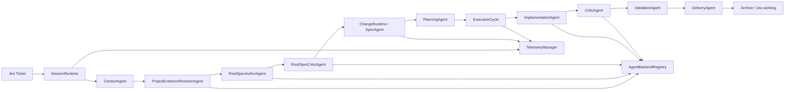
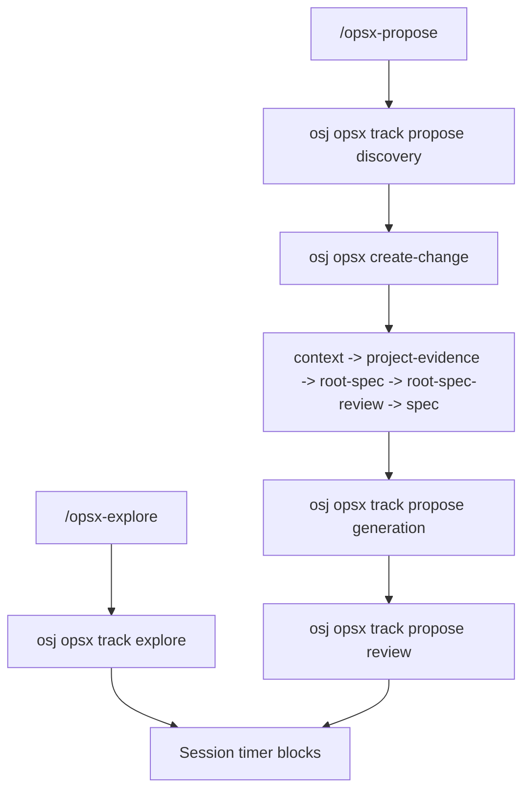
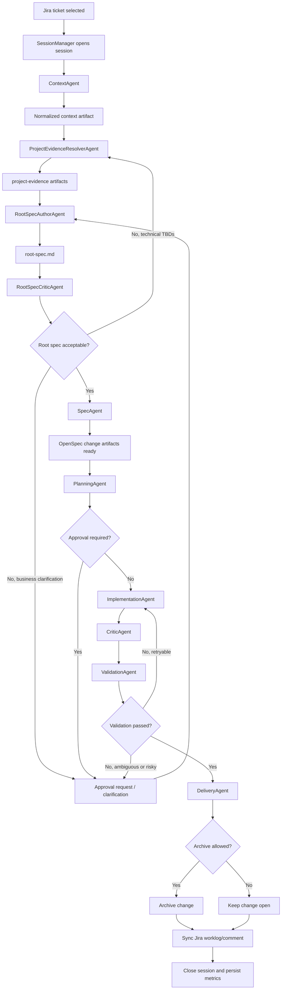

# Agentic Development Runtime Architecture

See also: [AGENTIC-FLOW](./AGENTIC-FLOW.md), [STATE-MACHINES](./STATE-MACHINES.md), [AGENT-CONTRACTS](./AGENT-CONTRACTS.md), [AGENT-BACKENDS](./AGENT-BACKENDS.md), [AUTONOMY-POLICY](./AUTONOMY-POLICY.md), [IMPLEMENTATION-BACKLOG](./IMPLEMENTATION-BACKLOG.md), [CURRENT-IMPLEMENTATION](./CURRENT-IMPLEMENTATION.md)

## Intent

`osj` should evolve from a Jira + timer CLI into the runtime of an agentic delivery cell. The goal is not "one agent that codes", but a governed system where humans and multiple specialized agents collaborate over one shared unit of work.

The execution primitive is:

```text
Work Unit = Jira Ticket + Session + Change + Execution Cycles
```

This architecture is designed for incremental implementation on top of the current repository. It is explicitly not a greenfield rewrite.

## Current Foundation In This Repo

The existing fork already provides the first runtime seams we need:

- `src/core/timer/types.ts` defines `TimerSession`, `TimerBlock`, and Jira sync results.
- `src/core/timer/store.ts` persists `.openspec/session.json` and archived session snapshots.
- `src/core/timer/commands.ts` already models session lifecycle states like `running`, `paused`, `sync_pending`, and `closed`.
- `src/core/archive.ts` provides governed archive behavior over OpenSpec changes.
- `src/core/validation/validator.ts` provides a validation boundary we can wrap instead of replacing immediately.
- `src/commands/workflow/opsx.ts` provides session-aware OPSX tracking and change creation helpers.
- `src/cli/index.ts` is already the integration point for `purpose`, `timer`, `archive`, and future runtime commands.

The runtime architecture below treats those modules as compatibility anchors and adds a formal multi-agent layer around them.

## Current Implementation Status

The repository has already landed a broader runtime slice than the original implementation plan:

- runtime state is formalized under `.openspec/runtime/`
- session, ticket, and change state are bridged from the existing timer flow
- `osj runtime explain` is available as a runtime inspection surface
- native `osj opsx track ...` and `osj opsx create-change ...` helpers bridge generated `/opsx` workflows back into runtime-governed session state
- the discovery layer is now implemented:
  - `ContextAgent`
  - `ProjectEvidenceResolverAgent`
  - `RootSpecAuthorAgent`
  - `RootSpecCriticAgent`
- `SpecAgent` now expands change artifacts from an accepted root spec instead of always scaffolding directly from imported ticket context
- `PlanningAgent`, `ImplementationAgent`, `CriticAgent`, `ValidationAgent`, and `DeliveryAgent` are implemented
- `ImplementationAgent` supports provider-agnostic backend routing through API, local command, or manual handoff modes
- execution cycles are persisted per change
- CLI orchestration currently reaches `delivery`

What is still not landed:

- a formal event bus and richer telemetry modules
- runtime graph commands and full auto orchestration
- deeper semantic validation beyond the current deterministic validation layer

## North Star

The target system is an **Agentic Development Runtime** for Jira-driven software delivery where humans and agents collaborate to:

1. interpret a Jira ticket
2. normalize context
3. generate or update OpenSpec artifacts
4. plan the technical execution
5. implement code and tests
6. critique and validate results
7. prepare governed closure
8. synchronize evidence, time, and Jira outcomes

## Runtime Collaboration Flow



## Design Principles

1. **Ticket-led execution**. Work begins from Jira or is explicitly linked back to Jira before closure.
2. **Explicit state**. No critical delivery state may live only in prompts, chat history, or agent memory.
3. **Specialized agents**. Roles are explicit and composable; there is no single super-agent.
4. **Governed autonomy**. The runtime decides what can run automatically and when it must stop for a human.
5. **Artifacts as evidence**. Every meaningful transformation leaves durable files or events.
6. **Time, cost, and quality are first-class**. They belong in the runtime contract, not in post-hoc analytics.
7. **Compatibility-first evolution**. Existing `osj` session/timer/archive workflows must keep working while the runtime becomes more capable.

## Core Runtime Model

### Core Entities

| Entity | Purpose | Source of truth |
| --- | --- | --- |
| `TicketRuntime` | Runtime state for one Jira issue inside the workspace | `.openspec/runtime/tickets/<ticket>/ticket-runtime.json` |
| `SessionRuntime` | Active or historical window of work | `.openspec/runtime/tickets/<ticket>/session.json` |
| `ChangeRuntime` | Runtime state of the OpenSpec change bound to the session | `.openspec/runtime/tickets/<ticket>/changes/<change>/change-runtime.json` |
| `ExecutionCycle` | One implementation/review/validation iteration | `.openspec/runtime/tickets/<ticket>/changes/<change>/cycles/cycle-<n>.json` |
| `AgentRun` | One execution of one agent | `.openspec/runtime/tickets/<ticket>/changes/<change>/agent-runs/run-<id>.json` |
| `WorkBlock` | Time-boxed work segment, human or agent driven | persisted under the session and telemetry views |
| `ApprovalRequest` | Human checkpoint opened by policy | `.openspec/runtime/tickets/<ticket>/approvals/<id>.json` |

### Compatibility Mapping

During phased implementation, keep these projections stable:

- `.openspec/session.json` remains the active-session compatibility view.
- `.openspec/sessions/*.json` remains the archived session view.
- `openspec/changes/<change>/` remains the durable OpenSpec artifact boundary.
- `TimerSession` becomes a projection of `SessionRuntime` plus current work block data.
- `TimerBlock` becomes the compatibility representation of `WorkBlock`.

The new runtime store becomes the source of truth; the old timer files remain projections until migration is complete.

## Layered Architecture

| Layer | Responsibility | Initial anchors |
| --- | --- | --- |
| Interface Layer | CLI commands, summaries, prompts, status views, approvals | `src/cli/index.ts`, existing command modules |
| Runtime Layer | session manager, orchestration, state engine, backend routing, event bus, artifact manager | new `src/core/runtime/**` |
| Agent Layer | specialized agent adapters and contracts | new `src/agents/**` |
| Verification Layer | validation, review, scoring, test execution, classification | existing `src/core/validation/**`, future runtime wrappers |
| Integration Layer | Jira, Git, CI, filesystem, future IDE hooks | existing `src/core/timer/jira-client.ts`, future `src/integrations/**` |
| Learning Layer | metrics, retries, cost, autonomy score, historical analysis | new telemetry/runtime analytics modules |

## Runtime Components

### `SessionManager`

Owns creation, loading, pausing, resuming, closing, and projection of runtime sessions. It also bridges the current timer session format to the new runtime format.

### OPSX Session Bridge

The generated `/opsx:explore` and `/opsx:propose` workflows should not bypass runtime governance when a Jira-backed session already exists.

The current bridge is:

- `/opsx:explore` -> `osj opsx track explore --json`
- `/opsx:propose` discovery -> `osj opsx track propose discovery --json`
- `/opsx:propose` change creation -> `osj opsx create-change <name>`
- `/opsx:propose` generation/review phases -> `osj opsx track propose generation|review`

The important architectural change is that `osj opsx create-change <name>` is now session-aware. In a Jira-backed session it:

1. optionally persists a discovery-side `change-name-hint.json`
2. orchestrates through:
   - `context`
   - `project-evidence`
   - `root-spec`
   - `root-spec-review`
   - `spec`
3. returns control to OPSX review tracking after the autonomous generation slice

This keeps prompt-driven UX while moving timer classification, imported-ticket reuse, discovery artifacts, and session/change linkage into the CLI/runtime boundary instead of leaving them as prompt-only conventions.



### `StateEngine`

Validates transitions across ticket, session, change, cycle, and agent-run state machines. It emits transition events and rejects invalid state moves before side effects happen.

### `AgentOrchestrator`

Selects the next agent, builds the agent envelope, invokes the adapter, stores outputs, and evaluates retry/escalation rules. It is the heart of the execution loop.

### `AgentBackendRegistry`

Resolves provider/backend connectivity per agent. It keeps the runtime independent from one vendor or one transport and supports:

- OpenAI-compatible HTTP APIs
- local command runners
- manual prompt handoff

### `ArtifactManager`

Resolves and writes:

- OpenSpec artifacts under `openspec/changes/`
- runtime artifacts under `.openspec/runtime/`
- auxiliary outputs such as normalized context, plans, review reports, and closure summaries

### `ContextResolver`

Combines Jira issue data, session state, change artifacts, repo metadata, previous agent outputs, and current policy into one normalized input bundle for agents.

### `ValidationRunner`

Runs deterministic checks and normalizes their output. In early phases it should wrap existing validators and test runners instead of inventing a second validation system.

### `TelemetryManager`

Tracks work blocks, agent runtimes, retry counts, cost estimates, and the final autonomy score inputs.

### `IntegrationGateway`

Abstracts Jira, Tempo-through-Jira, Git, CI, and future IDE/editor bridges behind stable interfaces so the orchestration loop stays testable.

## Target Module Layout

The recommended target shape is:

```text
src/
  cli/
    commands/
      runtime/
      agent/
      approval/
  core/
    runtime/
      session/
      state/
      orchestration/
      artifacts/
      context/
      events/
      validation/
      telemetry/
  agents/
    base/
    context/
    spec/
    planning/
    implementation/
    critic/
    validation/
    delivery/
  integrations/
    jira/
    git/
    ci/
  storage/
    fs/
```

### Incremental Landing Rule

Do **not** start by renaming `src/core/timer/**` or `src/core/archive.ts`.

Instead:

1. add runtime modules alongside existing ones
2. treat timer/archive/validation as adapters into the new runtime
3. migrate command handlers once the runtime projections are stable

This keeps the first implementation phases small and reversible.

## Persistence Model

### Recommended Runtime Tree

```text
.openspec/runtime/
  tickets/PROJ-123/
    ticket-runtime.json
    session.json
    approvals/
      approval-001.json
    changes/
      implement-worklog-sync/
        change-runtime.json
        cycles/
          cycle-001.json
        context/
          normalized-context.json
          context-summary.md
        planning/
          execution-plan.json
          execution-plan.md
        implementation/
          change-report.json
        review/
          critic-report-001.json
        validation/
          validation-001.json
        delivery/
          closure-summary.json
        agent-runs/
          run-001.json
        events/
          events.ndjson
```

### Storage Rules

- Filesystem remains the default store for the MVP and early multi-agent phases.
- Runtime JSON files must be append-safe and deterministic so they can be inspected or repaired manually.
- Event data should be written in append-friendly form, preferably `ndjson`.
- A database should only be introduced when concurrent sessions, central dashboards, or multi-user analytics become a hard requirement.

## End-To-End Flow



## CLI Surface

The runtime should preserve existing `osj` flows and add new surfaces gradually:

### Preserve

- `osj purpose`
- `osj timer start|pause|resume|switch|status|report|bugfix|cancel`
- `osj archive`
- `osj validate`
- generated `/opsx:*` workflows as the chat-facing interface layer

### Add

- `osj runtime status`
- `osj runtime explain`
- `osj runtime graph`
- `osj opsx track <workflow> [phase]`
- `osj opsx create-change [name]`
- `osj agent run <agent>`
- `osj orchestrate --from-session`
- `osj orchestrate --until <stage>`
- `osj orchestrate --auto`
- `osj approval show|accept|reject`

### CLI Design Rule

Early phases should implement runtime commands as read-heavy and explanation-heavy before introducing fully automatic orchestration. This keeps the system observable while the state model stabilizes.

OPSX chat workflows should prefer thin wrappers over these CLI/runtime commands instead of re-implementing timer, ticket, or archive semantics in prompt text.

## What This Architecture Intentionally Does Not Do

- It does not replace Jira workflow state. Runtime state complements Jira state.
- It does not make archive and worklog sync the same concern. They remain linked but independently classifiable.
- It does not assume a single model or provider. "Agent" means adapter behind a common contract.
- It does not require immediate database adoption.
- It does not require full autonomy from day one. The default operating mode is governed, assisted autonomy.

## Definition Of The Current Successful Slice

The current meaningful milestone is a **runtime-aware multi-agent loop with governed discovery**:

- formal runtime state
- normalized context generation
- repository-backed evidence generation
- prompt-driven root spec generation
- root spec review and clarification loop
- OpenSpec change expansion from the root spec
- planning artifact generation
- implementation run adapter
- critic report
- validation result
- archive-readiness decision

Those artifacts now exist and can be inspected from the CLI, which makes the runtime visible enough for continued phased delivery.
