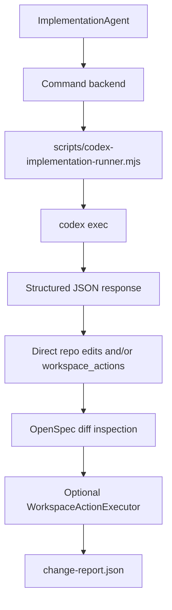

# Codex CLI Integration

See also: [AGENT-BACKENDS](./AGENT-BACKENDS.md), [CURRENT-IMPLEMENTATION](./CURRENT-IMPLEMENTATION.md)

## Purpose

This document explains how to use Codex CLI as the local `command` backend for `ImplementationAgent`.

## Recommended Setup

The current recommended integration is:

1. `ImplementationAgent` routes to a `command` backend.
2. That backend runs `node scripts/codex-implementation-runner.mjs`.
3. The runner calls `codex exec` in `workspace-write` mode with `direct_edit` enabled.
4. Codex can edit the repo directly and still return structured JSON.
5. OpenSpec inspects the resulting diff, persists artifacts, and continues through critic/validation.

## Flow



## Why This Shape

This setup keeps governance inside OpenSpec while allowing faster implementation loops:

- Codex can inspect and edit the repo directly for implementation work
- OpenSpec still decides how the resulting diff is interpreted for autonomy, review, validation, and closeout
- the runtime can still use `workspace_actions` when a backend prefers bounded runtime-applied operations

## Files

- runner: [scripts/codex-implementation-runner.mjs](/Users/pm-ebrana/Documents/Replace/OpenSpec/scripts/codex-implementation-runner.mjs)
- config helper: [scripts/configure-codex-backend.mjs](/Users/pm-ebrana/Documents/Replace/OpenSpec/scripts/configure-codex-backend.mjs)

## Configure It

If you already logged into Codex CLI, run:

```bash
node scripts/configure-codex-backend.mjs
pnpm build
```

That configures:

- `agents.routing.implementation = "codex-cli"`
- `agents.backends.codex-cli.mode = "command"`
- `agents.backends.codex-cli.command = "node"`
- `agents.backends.codex-cli.args = ["scripts/codex-implementation-runner.mjs"]`
- `agents.backends.codex-cli.sandbox_mode = "workspace-write"`
- `agents.backends.codex-cli.implementation_mode = "direct_edit"`

## Optional Environment Overrides

The runner supports these optional env vars:

- `OSJ_CODEX_MODEL`
- `OSJ_CODEX_PROFILE`
- `OSJ_CODEX_SANDBOX`
- `OSJ_CODEX_ADD_DIRS`

Defaults:

- sandbox defaults to `read-only` unless backend config sets `sandbox_mode`
- no model override is sent unless `OSJ_CODEX_MODEL` is set
- user Codex config is ignored by default so broken MCP entries or local plugins do not affect runtime execution

If you explicitly want the runner to use your normal Codex user config, set:

```bash
OSJ_CODEX_USE_USER_CONFIG=1
```

## Notes

- In `direct_edit` mode, Codex may patch files directly inside the workspace.
- OpenSpec still evaluates the resulting diff against runtime policy and continues through critic/validation.
- `workspace_actions` remain supported for bounded runtime-applied edits and focused verification commands.
