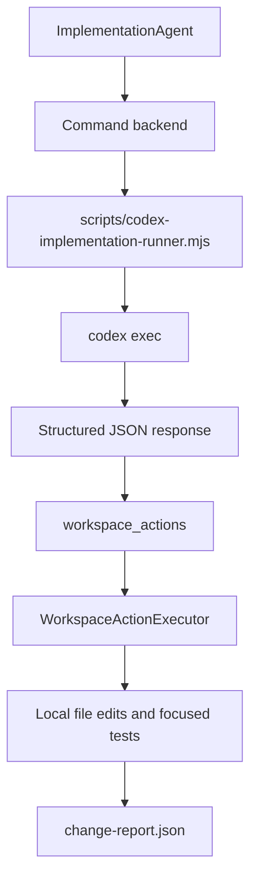

# Codex CLI Integration

See also: [AGENT-BACKENDS](./AGENT-BACKENDS.md), [CURRENT-IMPLEMENTATION](./CURRENT-IMPLEMENTATION.md)

## Purpose

This document explains how to use Codex CLI as the local `command` backend for `ImplementationAgent`.

## Recommended Setup

The current recommended integration is:

1. `ImplementationAgent` routes to a `command` backend.
2. That backend runs `node scripts/codex-implementation-runner.mjs`.
3. The runner calls `codex exec` in read-only mode.
4. Codex returns structured `workspace_actions`.
5. OpenSpec applies those actions locally under runtime policy.

## Flow



## Why This Shape

This setup keeps governance inside OpenSpec:

- Codex can inspect the repo and reason about the change
- OpenSpec remains the system that decides whether local edits and commands are allowed
- policy, artifact persistence, and review/validation stay in one runtime

## Files

- runner: [scripts/codex-implementation-runner.mjs](/Users/pm-ebrana/Documents/Replace/OpenSpec/scripts/codex-implementation-runner.mjs)
- config helper: [scripts/configure-codex-backend.mjs](/Users/pm-ebrana/Documents/Replace/OpenSpec/scripts/configure-codex-backend.mjs)

## Configure It

If you already logged into Codex CLI, run:

```bash
node scripts/configure-codex-backend.mjs
pnpm build
```

That configures:

- `agents.routing.implementation = "codex-cli"`
- `agents.backends.codex-cli.mode = "command"`
- `agents.backends.codex-cli.command = "node"`
- `agents.backends.codex-cli.args = ["scripts/codex-implementation-runner.mjs"]`

## Optional Environment Overrides

The runner supports these optional env vars:

- `OSJ_CODEX_MODEL`
- `OSJ_CODEX_PROFILE`
- `OSJ_CODEX_SANDBOX`
- `OSJ_CODEX_ADD_DIRS`

Defaults:

- sandbox defaults to `read-only`
- no model override is sent unless `OSJ_CODEX_MODEL` is set
- user Codex config is ignored by default so broken MCP entries or local plugins do not affect runtime execution

If you explicitly want the runner to use your normal Codex user config, set:

```bash
OSJ_CODEX_USE_USER_CONFIG=1
```

## Notes

- The runner asks Codex to stay read-only and return `workspace_actions`, not to patch files directly.
- OpenSpec still blocks writes to runtime artifacts and the active change scaffold.
- Focused verification commands remain allowlisted by `WorkspaceActionExecutor`.
