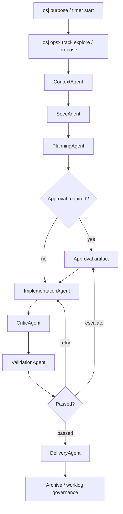
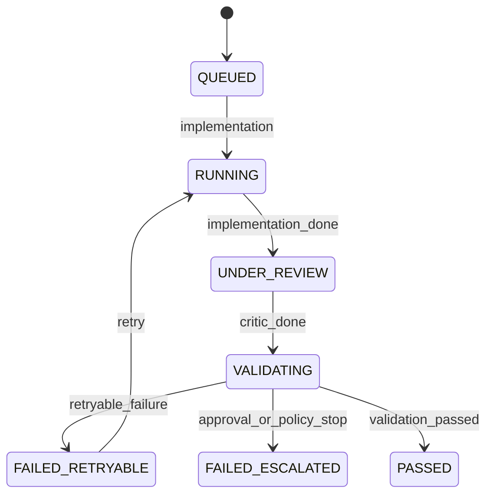

# Current Runtime Implementation

See also: [ARCHITECTURE](./ARCHITECTURE.md), [STATE-MACHINES](./STATE-MACHINES.md), [AGENT-CONTRACTS](./AGENT-CONTRACTS.md), [AGENT-BACKENDS](./AGENT-BACKENDS.md), [AUTONOMY-POLICY](./AUTONOMY-POLICY.md), [IMPLEMENTATION-BACKLOG](./IMPLEMENTATION-BACKLOG.md)

## Purpose

This document describes what is already implemented in the repository after the first seven runtime PRs. It is intentionally narrower than the architecture docs and should be treated as the operational source of truth for the current vertical slice.

## What Is Running Today

The repository already supports a visible multi-agent runtime slice over an active Jira-backed session:

1. `osj purpose` or `osj timer start` opens a runtime-aware session.
2. `osj runtime status` shows ticket, session, change, and cycle state.
3. `osj runtime explain` summarizes blockers, evidence, and next actions.
4. `osj opsx track explore|propose ...` and `osj opsx create-change ...` provide native session-aware governance for the generated `/opsx` workflows.
5. `osj agent run context` creates normalized context artifacts.
6. `osj agent run spec` creates or reuses OpenSpec change artifacts.
7. `osj agent run planning` writes an execution plan.
8. `osj agent run implementation` can prepare or invoke a configured backend, apply runtime-controlled local workspace actions, run focused verification commands, inspect the active workspace diff, apply autonomy policy checks, and write an implementation report.
9. `osj agent run critic` reviews the implementation report against plan and context.
10. `osj agent run validation` runs OpenSpec validation plus runtime checks and decides whether the loop should retry, escalate, or continue to delivery.
11. `osj agent run delivery` prepares closure evidence, archive decision data, and Jira comment draft.
12. `osj approval show|accept|reject` exposes human checkpoints as runtime artifacts.
13. `osj orchestrate --until delivery` runs the whole current slice through governed closeout.

## Current Runtime Flow



## Commands Available Now

```text
osj runtime status [--json]
osj runtime explain [--json]

osj opsx track explore [phase] [--json]
osj opsx track propose [phase] [--json]
osj opsx create-change [name] [--schema <name>]

osj agent run context
osj agent run spec
osj agent run planning
osj agent run implementation
osj agent run critic
osj agent run validation
osj agent run delivery

osj orchestrate --until context
osj orchestrate --until spec
osj orchestrate --until planning
osj orchestrate --until implementation
osj orchestrate --until critic
osj orchestrate --until validation
osj orchestrate --until delivery

osj approval show [--json]
osj approval accept <approval-id> [--reason "..."]
osj approval reject <approval-id> --reason "..."
```

## Persisted Runtime Artifacts

The runtime now persists:

- ticket runtime state in `.openspec/runtime/tickets/<ticket>/ticket-runtime.json`
- session runtime state in `.openspec/runtime/tickets/<ticket>/session.json`
- change runtime state in `.openspec/runtime/tickets/<ticket>/changes/<change>/change-runtime.json`
- execution cycles in `.openspec/runtime/tickets/<ticket>/changes/<change>/cycles/cycle-<n>.json`
- agent runs in `.openspec/runtime/tickets/<ticket>/changes/<change>/agent-runs/run-<id>.json`
- context artifacts under `context/`
- planning artifacts under `planning/`
- implementation report under `implementation/`
- critic report under `review/`
- validation result under `validation/`
- delivery closure summary and archive decision under `delivery/`
- approval artifacts under `approvals/`

## Agent Behavior Implemented Today

### Context Agent

- Parses structured Jira SDD when available.
- Falls back to heuristics for unstructured descriptions.
- Writes `normalized-context.json` and `context-summary.md`.
- Does not use an LLM fallback yet.

### Spec Agent

- Creates the change when missing.
- Reuses existing change artifacts when the session already has a change.
- Keeps runtime context attached to the change.

### Planning Agent

- Generates a heuristic execution plan and likely affected files.
- Recommends `RUN_IMPLEMENTATION_AGENT` when risk is acceptable and ambiguities are clear.
- Recommends `REQUEST_HUMAN_APPROVAL` for high-risk or ambiguous work.

### Implementation Agent

- Is now a controlled workspace adapter with pluggable backend connectivity.
- Inspects the active workspace diff, excluding `.openspec/runtime/**` and the active OpenSpec change scaffold.
- Can apply runtime-controlled local actions returned by the backend:
  - `write_file`
  - `replace_in_file`
  - `delete_file`
  - `run_command`
- Can route through:
  - `manual`
  - `openai_compatible`
  - `command`
  - `anthropic_native`
  - `gemini_native`
- Persists backend prompt/request/response artifacts when a backend is configured.
- Persists workspace execution results, including touched files, executed commands, and blocked actions.
- Reports changed files, tests added, task progress heuristics, and policy scope.
- Escalates when file-count, diff-size, or high-risk path policy is exceeded.

Current nuance:

- hosted API modes can now change local files when they return `workspace_actions` and those actions pass runtime policy
- `command` mode is the preferred path for local code-editing runners.
- `anthropic_native` calls Anthropic Messages API directly.
- `gemini_native` supports Gemini Developer API and Vertex AI / GCP bearer-token calls.
- in Vertex auto mode, the runtime can resolve credentials from explicit token config, `GOOGLE_OAUTH_ACCESS_TOKEN`, `gcloud` ADC, or `gcloud` CLI login.
- runtime-applied commands are restricted to a focused allowlist such as `node --test`, `vitest`, and `tsc --noEmit`
- runtime-applied writes are blocked for `.git/**`, `.openspec/runtime/**`, and `openspec/changes/<active-change>/**`

### Critic Agent

- Reviews the implementation report against the plan and normalized context.
- Flags blocking issues such as missing implementation, unresolved ambiguities, missing test coverage, or policy violations.
- Produces `critic-report.json` and `critic-report.md`.
- Can now route through dedicated reviewer backends, including Codex CLI and Gemini CLI command adapters, while keeping deterministic fallback findings.

### Validation Agent

- Wraps the existing OpenSpec validator for change delta specs.
- Adds runtime checks for critic approval and `tasks.md` completion.
- Classifies results as:
  - `PASSED`
  - `RETRYABLE_IMPLEMENTATION_ERROR`
  - `SPEC_AMBIGUITY`
  - `ENVIRONMENT_FAILURE`
  - `REQUIRES_HUMAN_DECISION`
  - `NON_RECOVERABLE`
- Produces `validation-result.json` and `validation-result.md`.

### Delivery Agent

- Runs only after validation succeeds.
- Produces closure summary, worklog preview, and Jira comment draft.
- Produces archive decision data separate from validation output.
- Under the current default `L2_ASSISTED` autonomy, it creates an archive approval requirement before closeout.

### Approval Manager

- Persists approval artifacts under `.openspec/runtime/tickets/<ticket>/approvals/`.
- Supports listing, accepting, and rejecting approvals from the CLI.
- Updates runtime state when approvals are resolved.
- Drives archive gating through runtime evidence instead of CLI-only conditions.

### OPSX Session Helpers

- `osj opsx track explore --json` exposes imported Jira ticket context and, when the session is running, switches the active block to `human_agent_interaction / spec`.
- `osj opsx track propose discovery --json` marks collaborative planning before artifact generation.
- `osj opsx create-change <name>` prefers session-aware change creation, attaches the created change back to the active session, and uses autonomous `spec` tracking during generation when the session is running.
- `osj opsx track propose generation` and `osj opsx track propose review` make the autonomous generation phase and the human/AI review phase explicit in timer evidence.
- `sync_pending` sessions are intentionally blocked from `osj opsx create-change` until the developer recovers with `osj archive --retry` or discards with `osj timer cancel`.

## Current Cycle Semantics

- The runtime creates a new execution cycle when implementation starts after no prior cycle or after a terminal cycle.
- The same cycle advances through implementation, critic, and validation.
- Validation moves the cycle to:
  - `PASSED`
  - `FAILED_RETRYABLE`
  - `FAILED_ESCALATED`
- Delivery runs after the cycle is terminal and does not create a new execution cycle.



## Archive Governance Implemented Today

- If a runtime-managed change exists, `osj archive` now checks runtime delivery/approval state before archiving.
- A pending archive approval blocks archive.
- Missing delivery decision blocks archive for runtime-managed changes.
- Worklog evidence remains conceptually separable from archive; archive can be blocked while time evidence is still allowed.

## Current Limitations

These are important and intentional:

- only `ImplementationAgent` consumes the shared backend registry today; the other agents still use local deterministic logic
- hosted API backends do not get arbitrary filesystem access; they can only affect the repo through runtime-applied `workspace_actions` or through their own external tool runtime
- `osj runtime graph` and `osj orchestrate --auto` are not implemented yet.
- `osj runtime explain` exists, but its policy-budget and multi-cycle explanations can still get richer.
- Event bus and telemetry persistence are still implicit or partial rather than formalized as dedicated modules.
- `ContextAgent` does not yet use a system prompt to synthesize a structured SDD from a weak Jira description.
- Archive governance is implemented, but Jira comment publication is still a draft/evidence step rather than a dedicated delivery-side integration module.

## What The Next PRs Should Do

The next meaningful runtime PRs should focus on operational maturity:

1. deepen `osj runtime explain` and orchestration summaries around why the runtime stopped
2. formalize event bus and telemetry persistence
3. move more agents onto the shared backend registry where it adds real value
4. deepen Jira-side delivery integration from draft artifacts into optional outbound actions
