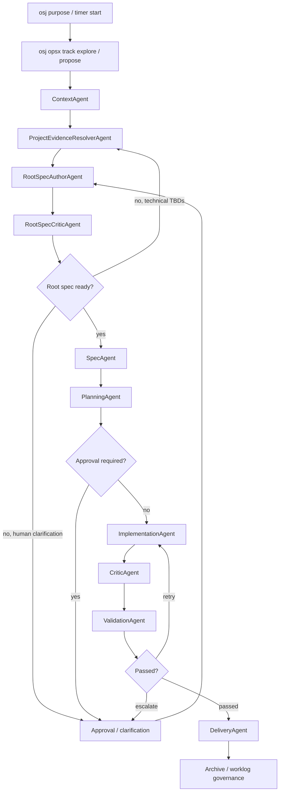

# Current Runtime Implementation

See also: [AGENTIC-FLOW](./AGENTIC-FLOW.md), [ARCHITECTURE](./ARCHITECTURE.md), [STATE-MACHINES](./STATE-MACHINES.md), [AGENT-CONTRACTS](./AGENT-CONTRACTS.md), [AGENT-BACKENDS](./AGENT-BACKENDS.md), [ROOT-SPEC-PROMPT](./ROOT-SPEC-PROMPT.md), [ROOT-SPEC-RUNTIME-DESIGN](./ROOT-SPEC-RUNTIME-DESIGN.md), [IMPLEMENTATION-BACKLOG](./IMPLEMENTATION-BACKLOG.md)

## Purpose

This document is the operational source of truth for what is already implemented in the runtime.

It focuses on:

- the actual agent order running today
- the persisted artifacts produced by each stage
- the current CLI surface
- the discovery/root-spec layer that now sits between Jira import and OpenSpec artifact expansion

## What Is Running Today

The repository already supports a governed multi-agent runtime over an active Jira-backed session:

1. `osj purpose` or `osj timer start` opens a runtime-aware session.
2. `osj runtime status` and `osj runtime explain` expose current runtime state.
3. `osj opsx track explore|propose ...` bridges OPSX workflows into session-governed timer evidence.
4. `osj opsx create-change <name>` can now run a session-aware discovery flow instead of only creating a scaffold.
5. `osj agent run context` creates normalized ticket context.
6. `osj agent run project-evidence` creates repository-backed technical evidence.
7. `osj agent run root-spec` generates a root `spec.md` using the embedded product/business-analysis prompt.
8. `osj agent run root-spec-review` critiques the root spec and drives the discovery loop.
9. `osj agent run spec` expands the accepted root spec into OpenSpec change artifacts.
10. `osj agent run planning` writes the execution plan.
11. `osj agent run implementation` performs governed implementation work through the configured backend/runtime adapter.
12. `osj agent run critic` reviews the implementation report.
13. `osj agent run validation` classifies pass, retry, escalation, or block.
14. `osj agent run delivery` prepares closeout evidence and archive readiness.
15. `osj approval show|accept|reject` resolves human checkpoints.

## Implemented Stage Order

The current orchestrator executes these stages in order:

```text
context
-> project-evidence
-> root-spec
-> root-spec-review
-> spec
-> planning
-> implementation
-> critic
-> validation
-> delivery
```

## Current Runtime Flow



## Where The New Prompt Lives And Runs

The new prompt is now a first-class runtime asset.

Source of truth in code:

- `src/agents/root-spec/root-spec-prompt.ts`

Human-readable mirror:

- [ROOT-SPEC-PROMPT](./ROOT-SPEC-PROMPT.md)

Runtime execution point:

- `RootSpecAuthorAgent`

What happens at that point:

1. the agent receives normalized Jira context
2. it receives project evidence derived from the repository
3. it injects the root-spec author prompt
4. it asks the backend to return structured JSON
5. it writes the returned `spec_markdown` into `.openspec/runtime/tickets/<ticket>/discovery/root-spec.md`

If a backend is configured, the runtime can also persist:

- `root-spec-backend-prompt.md`
- `root-spec-backend-request.json`
- `root-spec-backend-response.json`

## Commands Available Now

```text
osj runtime status [--json]
osj runtime explain [--json]

osj opsx track explore [phase] [--json]
osj opsx track propose [phase] [--json]
osj opsx create-change [name] [--schema <name>]

osj agent run context
osj agent run project-evidence
osj agent run root-spec
osj agent run root-spec-review
osj agent run spec
osj agent run planning
osj agent run implementation
osj agent run critic
osj agent run validation
osj agent run delivery

osj orchestrate --until context
osj orchestrate --until project-evidence
osj orchestrate --until root-spec
osj orchestrate --until root-spec-review
osj orchestrate --until spec
osj orchestrate --until planning
osj orchestrate --until implementation
osj orchestrate --until critic
osj orchestrate --until validation
osj orchestrate --until delivery

osj approval show [--json]
osj approval accept <approval-id> [--reason "..."]
osj approval reject <approval-id> --reason "..."
```

## Persisted Runtime Artifacts

The runtime now persists:

- ticket runtime state in `.openspec/runtime/tickets/<ticket>/ticket-runtime.json`
- session runtime state in `.openspec/runtime/tickets/<ticket>/session.json`
- change runtime state in `.openspec/runtime/tickets/<ticket>/changes/<change>/change-runtime.json`
- execution cycles in `.openspec/runtime/tickets/<ticket>/changes/<change>/cycles/cycle-<n>.json`
- agent runs in `.openspec/runtime/tickets/<ticket>/changes/<change>/agent-runs/run-<id>.json`
- approvals in `.openspec/runtime/tickets/<ticket>/approvals/`

Discovery-stage artifacts:

- `context/normalized-context.json`
- `context/context-summary.md`
- `discovery/project-evidence.json`
- `discovery/project-evidence.md`
- `discovery/root-spec.md`
- `discovery/root-spec-metadata.json`
- `discovery/root-spec-review.json`
- `discovery/root-spec-review.md`
- optional `discovery/change-name-hint.json`

Change-stage artifacts:

- `openspec/changes/<change>/root-spec.md`
- `openspec/changes/<change>/proposal.md`
- `openspec/changes/<change>/tasks.md`

Execution-stage artifacts:

- `planning/execution-plan.json`
- `planning/execution-plan.md`
- `implementation/change-report.json`
- `implementation/change-report.md`
- `review/critic-report.json`
- `review/critic-report.md`
- `validation/validation-result.json`
- `validation/validation-result.md`
- `delivery/closure-summary.json`
- `delivery/archive-decision.json`

## Agent Behavior Implemented Today

### Context Agent

- parses structured Jira SDD when available
- falls back to heuristics for unstructured ticket descriptions
- writes normalized context artifacts
- returns `RUN_PROJECT_EVIDENCE_RESOLVER_AGENT`

### ProjectEvidenceResolverAgent

- inspects repository evidence before the root spec is finalized
- can surface:
  - relevant modules
  - impacted layers
  - technical constraints
  - existing contracts, enums, and states
  - unresolved technical TBDs
- writes `project-evidence.json` and `project-evidence.md`
- returns `RUN_ROOT_SPEC_AUTHOR_AGENT`

### RootSpecAuthorAgent

- loads the embedded root-spec author prompt
- combines imported Jira context with project evidence
- generates a root `spec.md`
- writes:
  - `root-spec.md`
  - `root-spec-metadata.json`
- returns `RUN_ROOT_SPEC_CRITIC_AGENT`

### RootSpecCriticAgent

- reviews the generated root spec for:
  - missing coverage
  - contradictory requirements
  - technical TBDs resolvable from repo evidence
  - business TBDs that need clarification
- can loop back to:
  - `project_evidence_resolver_agent`
  - `root_spec_author_agent`
- can request human approval/clarification with `root_spec` scope
- on success, returns `RUN_SPEC_AGENT`

### Spec Agent

- creates or reuses the change once the root spec is acceptable
- expands root-spec-driven artifacts into the OpenSpec change
- keeps runtime/change linkage aligned

### Planning Agent

- generates a heuristic execution plan and likely affected files
- opens a `plan` approval when risk or ambiguity requires it

### Implementation Agent

- is the main controlled workspace execution adapter
- supports backend routing
- persists backend prompt/request/response artifacts
- applies governed local workspace actions
- measures scope against a per-run baseline instead of the full dirty worktree

### Critic Agent

- reviews the implementation report against context and plan
- keeps deterministic findings
- can route through dedicated reviewer backends such as Codex CLI and Gemini CLI

### Validation Agent

- wraps existing OpenSpec validation
- adds runtime checks for critic approval and task completion
- classifies:
  - `PASSED`
  - `RETRYABLE_IMPLEMENTATION_ERROR`
  - `SPEC_AMBIGUITY`
  - `ENVIRONMENT_FAILURE`
  - `REQUIRES_HUMAN_DECISION`
  - `NON_RECOVERABLE`

### Delivery Agent

- prepares closure evidence after validation succeeds
- produces archive decision data
- separates delivery readiness from archive execution

## OPSX Session Helpers Implemented Today

- `osj opsx track explore --json`
  exposes imported Jira ticket context and marks collaborative exploration.
- `osj opsx track propose discovery --json`
  marks the start of governed proposal/discovery work.
- `osj opsx create-change <name>`
  now prefers a session-aware orchestration path:
  - writes `change-name-hint.json` when a name is provided
  - orchestrates until `spec`
  - restores the human interaction block after autonomous generation
- `osj opsx track propose generation`
  makes autonomous artifact generation explicit in timer evidence.
- `osj opsx track propose review`
  marks human+AI review after artifact generation.

## Example: Jira + OPSX + Root Spec

```bash
osj purpose --jira PROJ-123 --import-ticket
osj opsx track explore
osj opsx track propose discovery
osj opsx create-change autonomous-plan-for-feature-x
osj opsx track propose generation
osj orchestrate --until planning
osj opsx track propose review
osj orchestrate --until implementation
```

What this does:

1. imports the Jira ticket into the runtime session
2. records collaborative discovery in timer evidence
3. enters proposal discovery mode
4. runs the discovery stack through `spec`
5. expands change artifacts from the accepted root spec
6. creates the plan
7. transitions into governed implementation

## Current Ticket States Used By The New Flow

The runtime now actively uses these additional ticket states before `SPEC_READY`:

- `DISCOVERY_IN_PROGRESS`
- `ROOT_SPEC_REVIEW`

In practice:

- `DISCOVERY_IN_PROGRESS` means the runtime is gathering repo evidence and/or drafting the root spec
- `ROOT_SPEC_REVIEW` means the root spec exists and is under automated review or waiting for clarification

## Current Limitations

These are still important:

- not every agent necessarily uses the shared backend registry in the same way
- validation is still deterministic and not yet semantically enriched by a second review layer
- runtime explain and telemetry can still become richer
- local no-Jira fixture flows are weaker than Jira-backed flows
- the discovery loop is implemented, but its analytics and telemetry are still simpler than the execution loop

## What To Read Next

Recommended order:

1. [AGENTIC-FLOW](./AGENTIC-FLOW.md)
2. [ARCHITECTURE](./ARCHITECTURE.md)
3. [STATE-MACHINES](./STATE-MACHINES.md)
4. [ROOT-SPEC-PROMPT](./ROOT-SPEC-PROMPT.md)
5. [AGENT-BACKENDS](./AGENT-BACKENDS.md)
