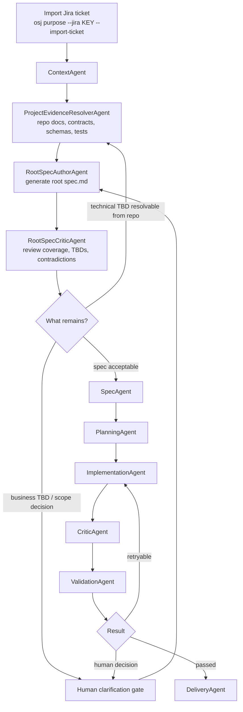

# Root Spec Runtime Design

See also: [AGENTIC-FLOW](./AGENTIC-FLOW.md), [ARCHITECTURE](./ARCHITECTURE.md), [CURRENT-IMPLEMENTATION](./CURRENT-IMPLEMENTATION.md), [AGENT-CONTRACTS](./AGENT-CONTRACTS.md), [IMPLEMENTATION-BACKLOG](./IMPLEMENTATION-BACKLOG.md)

> [!NOTE]
> The core discovery flow described in this document is now implemented. Treat this document as the detailed design rationale behind the current root-spec layer, while [AGENTIC-FLOW](./AGENTIC-FLOW.md) and [CURRENT-IMPLEMENTATION](./CURRENT-IMPLEMENTATION.md) describe the operational flow as it runs today.

## Purpose

This document describes the design of the discovery/runtime extension that now sits between imported Jira context and OpenSpec-derived artifacts:

- generate one root `spec.md` before OpenSpec-derived artifacts
- resolve technical TBDs from repository evidence when possible
- preserve business ambiguity explicitly instead of silently inventing rules
- integrate the discovery/spec loop with `opsx` and `osj` governance

The core idea implemented in the runtime is:

```text
Imported Jira Ticket -> Normalized Context -> Root Spec Loop -> Derived Artifacts -> Planning -> Execution Loop
```

## Why This Layer Exists

The previous runtime went from imported ticket context directly into `SpecAgent` and `PlanningAgent`.

That was enough for the earlier vertical slice, but it was too shallow when the ticket is:

- incomplete
- ambiguous
- product-heavy
- dependent on existing project contracts
- dependent on repository conventions and prior documentation

The implemented solution is a governed root-spec loop that produces one high-quality `spec.md` before downstream planning artifacts are derived.

## Design Goal

The implemented collaborative discovery layer can:

1. preserve what Jira already says
2. enrich the spec with project evidence
3. resolve technical constraints from the repository where safe
4. ask for human clarification only when business-critical ambiguity remains
5. produce one durable `spec.md` that becomes the source document for:
   - `proposal.md`
   - `tasks.md`
   - OpenSpec delta spec
   - future `plan-*.md`
   - AI planning and QA prompts

## The Prompt Contract

The central authoring prompt for this layer is the product/business-analysis prompt supplied by the user and embedded in the runtime.

The runtime should treat that prompt as the contract for the new root spec generator:

- the output document is a hybrid `spec.md`
- missing information must be surfaced explicitly as `TBD`, assumptions, or questions
- user-provided criteria must be preserved
- rules of business, behavior, UX, contracts, and scope must stay separated
- the result must be useful for downstream AI planning and implementation

This prompt is versioned as a first-class runtime asset, not hidden in chat state.

Implemented storage:

```text
docs/agentic-runtime/ROOT-SPEC-PROMPT.md
```

## Where It Fits In The Flow

This layer belongs after ticket import and after minimal context normalization, but before derived artifact generation and planning.

In the current implementation, this means:

```text
ContextAgent
-> ProjectEvidenceResolverAgent
-> RootSpecAuthorAgent
-> RootSpecCriticAgent
-> SpecAgent
-> PlanningAgent
```

### Current implemented stage flow

1. `osj purpose --jira <KEY> --import-ticket`
2. `ContextAgent`
3. `ProjectEvidenceResolverAgent`
4. `RootSpecAuthorAgent`
5. `RootSpecCriticAgent`
6. human clarification gate only if required
7. `SpecAgent`
8. `PlanningAgent`
9. existing execution loop:
   - `ImplementationAgent`
   - `CriticAgent`
   - `ValidationAgent`
   - `DeliveryAgent`

## Flow Diagram



## OPSX Integration

`opsx` should remain the conversational UX layer, while `osj` remains the governance and persistence layer.

### Recommended role split

#### `/opsx-explore`

Purpose:

- collaborative discovery
- requirement clarification
- early brainstorming

Runtime effect:

- maps to `osj opsx track explore`
- records `human_agent_interaction / spec`
- may surface imported Jira context and existing root-spec artifacts if present

#### `/opsx-propose`

Purpose:

- entrypoint to the root spec loop

Runtime effect:

- maps to a new session-aware flow, conceptually:

```text
osj opsx track propose discovery
-> run evidence resolution
-> run root spec author
-> run root spec critic
-> if approved, create / attach change
-> expand derived artifacts
-> osj opsx track propose generation
-> osj opsx track propose review
```

### Critical rule

`osj opsx create-change` should move later in the proposal flow.

Instead of creating the change before the best spec exists, it should happen:

- after the root `spec.md` is acceptable
- before derived artifacts are expanded into the change

That keeps OPSX conversational while making the runtime artifact chain stronger.

## New Agents

The following agents are proposed.

## 1. `ProjectEvidenceResolverAgent`

### Purpose

Resolve technical TBDs and constraints using project evidence before the root spec is finalized.

### Inputs

- imported Jira ticket
- normalized context
- active repo contents
- project config context
- existing OpenSpec specs
- tests
- migrations
- schema files
- API contracts

### Outputs

Artifacts:

```text
.openspec/runtime/tickets/<ticket>/discovery/project-evidence.json
.openspec/runtime/tickets/<ticket>/discovery/project-evidence.md
```

Suggested schema:

- relevant modules
- candidate impacted layers
- technical constraints
- existing entities
- known states/enums
- inferred contracts
- unresolved technical TBDs
- confidence per finding
- evidence refs

### What it may resolve autonomously

High-autonomy areas:

- API contracts already represented in OpenAPI, clients, types, tests, or adapters
- DB schema already represented in Prisma, SQL migrations, Drizzle, TypeORM, etc.
- enums and allowed states
- existing permission constraints already encoded in the project
- shared DTO or payload expectations
- module/layer impact

### What it should not invent

- new business policy
- new product rules not evidenced in code or docs
- hidden provider contracts not visible in the repo

## 2. `RootSpecAuthorAgent`

### Purpose

Generate the root `spec.md` using the user-supplied prompt contract.

### Inputs

- imported ticket
- normalized context
- project evidence artifact
- previous root spec draft if retrying
- human answers if present

### Outputs

Artifacts:

```text
.openspec/runtime/tickets/<ticket>/discovery/root-spec.md
.openspec/runtime/tickets/<ticket>/discovery/root-spec-metadata.json
```

Metadata should include:

- prompt version
- author backend
- open questions
- assumptions inserted
- technical TBD count
- business TBD count

### Runtime mode

This agent should be LLM-backed.

It is the correct place to use a strong reasoning/writing model because the output is a business-facing root spec, not just internal runtime metadata.

## 3. `RootSpecCriticAgent`

### Purpose

Review the generated root `spec.md` before downstream artifacts are derived.

### Inputs

- root spec
- imported ticket
- normalized context
- project evidence

### Outputs

Artifacts:

```text
.openspec/runtime/tickets/<ticket>/discovery/root-spec-review.json
.openspec/runtime/tickets/<ticket>/discovery/root-spec-review.md
```

Review responsibilities:

- check preservation of user-provided criteria
- identify contradictions
- identify technical TBDs that still have not been resolved
- identify business TBDs requiring human clarification
- validate separation of:
  - goals vs non-goals
  - acceptance criteria vs business rules
  - business rules vs UX/error states
  - out of scope vs non-goals
- check traceability completeness

### Runtime mode

Recommended as hybrid:

- deterministic checks for required sections and formatting
- optional LLM reviewer backend for semantic completeness

## 4. `ArtifactExpanderAgent`

### Purpose

Generate downstream OpenSpec artifacts from the approved root `spec.md`.

This can be a new agent or a major refactor of the current `SpecAgent`.

### Inputs

- approved root spec
- active session
- change scaffold or change-to-create

### Outputs

- `openspec/changes/<change>/proposal.md`
- `openspec/changes/<change>/tasks.md`
- `openspec/changes/<change>/jira-ticket.md`
- `openspec/changes/<change>/specs/<change>/spec.md`
- optional `design.md`

### Runtime mode

Initially deterministic/template-driven.

Later this can add LLM expansion if needed, but it does not need to be the first LLM-heavy part of the flow.

## Artifacts And Storage

### Discovery-stage runtime folder

Recommended new folder:

```text
.openspec/runtime/tickets/<ticket>/discovery/
```

Recommended files:

```text
project-evidence.json
project-evidence.md
root-spec.md
root-spec-metadata.json
root-spec-review.json
root-spec-review.md
clarification-answers.json
```

### Change-stage artifacts

Once the root spec is approved:

```text
openspec/changes/<change>/proposal.md
openspec/changes/<change>/tasks.md
openspec/changes/<change>/jira-ticket.md
openspec/changes/<change>/specs/<change>/spec.md
```

### Source-of-truth rule

Before expansion:

- source of truth = runtime root spec

After expansion:

- source of truth = root spec + derived OpenSpec change artifacts

The root spec should not disappear after expansion. It remains the discovery authority.

## Runtime State Changes

The current runtime state model can support this extension with minimal additions.

### Suggested `TicketRuntimeState` additions

Add:

- `DISCOVERY_IN_PROGRESS`
- `ROOT_SPEC_REVIEW`

Suggested semantics:

- `DISCOVERY_IN_PROGRESS`: the runtime is collecting evidence and drafting the root spec
- `ROOT_SPEC_REVIEW`: the root spec exists and is under semantic review or human clarification

### Suggested `ChangeRuntimeState` additions

Add:

- `DISCOVERY_ONLY`

Use it only if a session has not yet expanded into a full OpenSpec change.

Alternative:

- keep change absent until expansion time

This second option is simpler and is preferred for first implementation.

### Suggested `SessionRuntimeState` reuse

No new session state is strictly required.

The current model can reuse:

- `ACTIVE`
- `AWAITING_HUMAN`
- `SYNC_PENDING`

### Suggested `ExecutionCycleState`

Do not overload implementation cycles for the root spec loop.

Instead, keep discovery as a pre-implementation stage and introduce a lighter discovery iteration count in runtime metadata:

- `discovery_iteration: 0..n`

This avoids conflating business discovery loops with code retry loops.

## Agent Contract Changes

The current `AgentName` and `NextAction` types will need to expand.

### Proposed new `AgentName` values

- `project_evidence_resolver_agent`
- `root_spec_author_agent`
- `root_spec_critic_agent`
- `artifact_expander_agent`

### Proposed new `NextAction` values

- `RUN_PROJECT_EVIDENCE_RESOLVER_AGENT`
- `RUN_ROOT_SPEC_AUTHOR_AGENT`
- `RUN_ROOT_SPEC_CRITIC_AGENT`
- `RUN_ARTIFACT_EXPANDER_AGENT`
- `REQUEST_ROOT_SPEC_CLARIFICATION`

### Proposed `AgentContext` additions

Add optional refs for:

- `existingProjectEvidence`
- `existingRootSpec`
- `existingRootSpecReview`
- `clarificationAnswers`

## Orchestrator Changes

`AgentOrchestrator` should insert a new governed discovery loop between `context` and `spec`.

### Proposed stage order

```text
context
project_evidence
root_spec
root_spec_review
artifact_expansion
planning
implementation
critic
validation
delivery
```

### Loop rule

1. `project_evidence`
2. `root_spec`
3. `root_spec_review`

If review finds:

- technical TBD resolvable from repo:
  - go back to `project_evidence`
- business TBD requiring human:
  - stop and request clarification
- no blocking issues:
  - proceed to `artifact_expansion`

### Iteration budget

Recommended:

- max `2` autonomous discovery iterations
- if still blocked, move to human clarification

That keeps the loop bounded.

## Autonomy Policy

This flow should not use one flat autonomy setting.

## Technical TBD autonomy

Recommended level: **high**

Allowed:

- infer contracts from code/docs/tests
- infer impacted layers
- infer schema constraints already represented in the repo
- propose explicit assumptions tied to evidence

## Business rule autonomy

Recommended level: **medium-low**

Allowed:

- complete stable business rules only when strongly evidenced by:
  - existing docs
  - existing specs
  - tests
  - behavior already implemented elsewhere

Not allowed without human confirmation:

- invent net-new product policy
- redefine scope
- create commercial/legal/eligibility rules
- override explicit ambiguity from Jira

### Decision rule

The runtime may resolve a business TBD automatically only if:

1. the behavior is strongly evidenced in the repo or docs
2. the inference is reversible
3. it does not materially redefine user-visible policy

Otherwise it must remain:

- `TBD`
- assumption
- or human question

## Example Ticket Type

This design is especially useful for tickets like:

```text
Como dev quiero un sistema de agentes que autonomamente cree un plan de trabajo
para implementar una feature X, que pueda resolver constraints and assumptions
revisando documentacion del proyecto y definir algunas reglas de negocio autonomamente.
```

### What the runtime should do well here

- resolve technical constraints from repo evidence
- derive impacted layers
- produce a root `spec.md`
- generate a plan and tasks
- close only low-risk business gaps autonomously

### What should still require human input

- new product policy
- unclear business success criteria
- contradictory scope
- rules without evidence

## CLI And UX Changes

### New suggested commands

```text
osj agent run project-evidence
osj agent run root-spec
osj agent run root-spec-review
osj agent run artifact-expansion
```

### New orchestration cut points

```text
osj orchestrate --until project-evidence
osj orchestrate --until root-spec
osj orchestrate --until root-spec-review
osj orchestrate --until artifact-expansion
```

### OPSX behavior

Recommended prompt behavior:

- `/opsx-explore`:
  - discovery discussion
  - optional evidence review
- `/opsx-propose`:
  - run root spec loop
  - create change only after root spec approval
- `/opsx-continue`:
  - continue artifact expansion or planning after clarification

## Implementation Strategy

Recommended sequence:

### Phase A

- add discovery artifacts folder
- add `ProjectEvidenceResolverAgent`
- add `RootSpecAuthorAgent`
- add `RootSpecCriticAgent`
- add orchestrator support and bounded loop

### Phase B

- refactor `SpecAgent` into `ArtifactExpanderAgent` behavior
- delay `osj opsx create-change` until after approved root spec

### Phase C

- add backend routing for root spec author/reviewer
- strengthen policy for technical-vs-business TBD closure

## Recommendation

The root spec loop should become the new proposal core.

The best operational model is:

- `opsx` = conversational discovery and proposal UX
- `osj` = runtime governance, persistence, approvals, and orchestration
- root `spec.md` = product/business source document
- OpenSpec change artifacts = derived implementation artifacts

This preserves the current architecture while making the runtime much better at:

- handling weak Jira tickets
- resolving technical TBDs from project evidence
- limiting unsafe invention of business rules
- producing better plans and tasks for downstream AI execution
