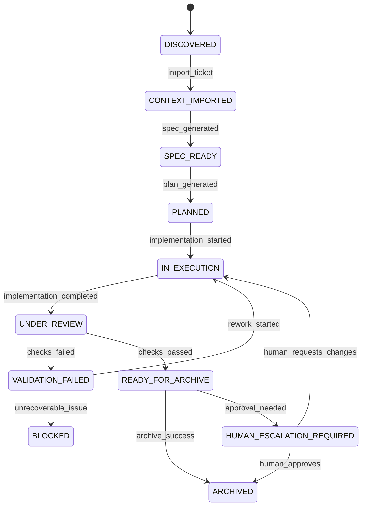
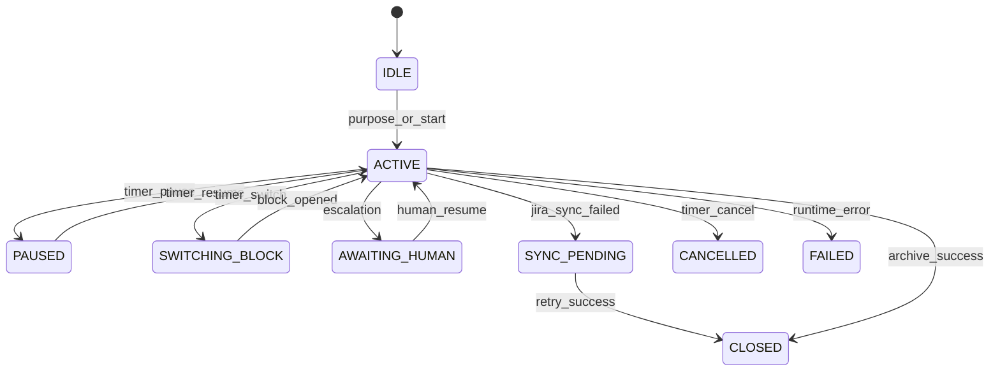
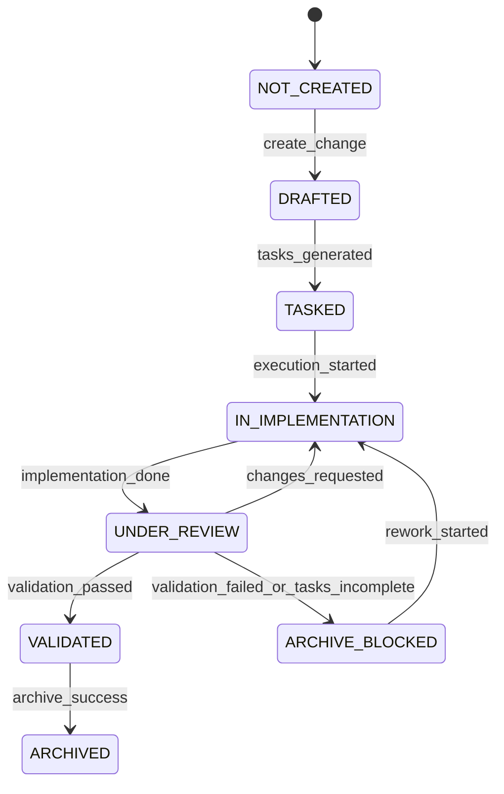
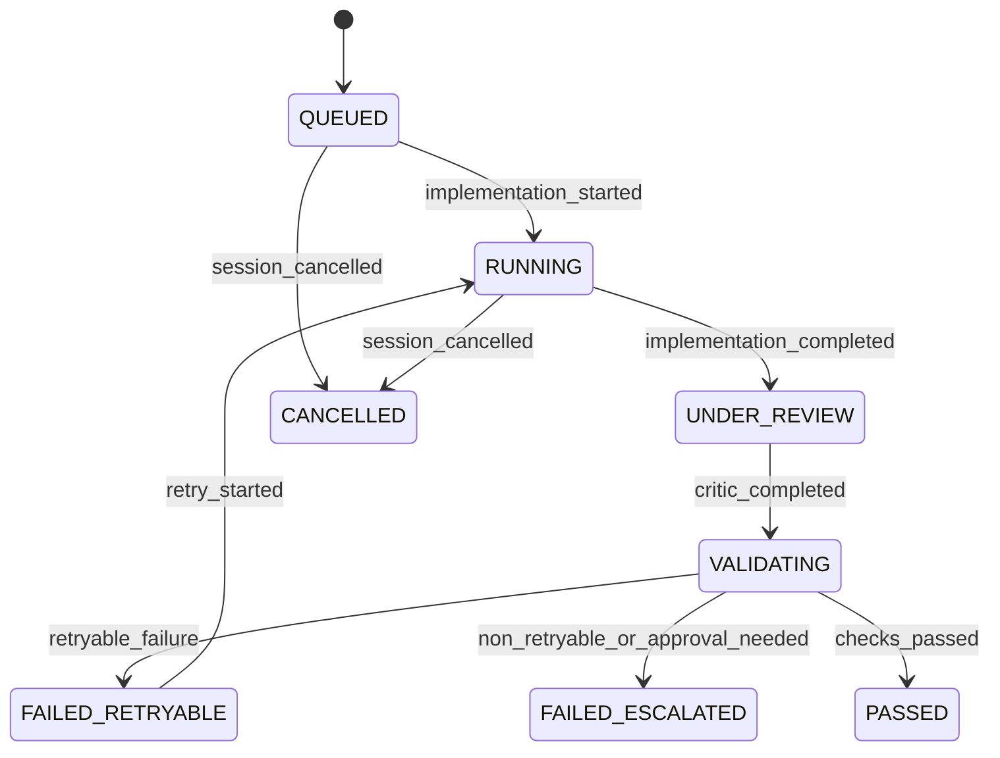
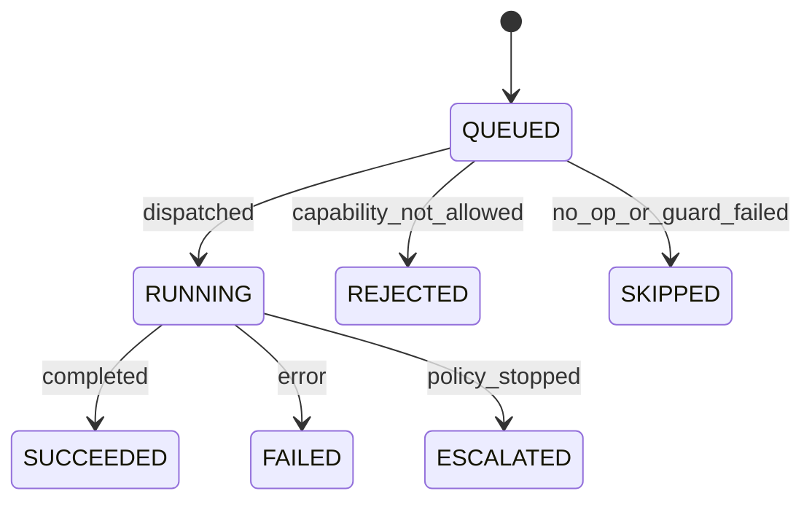

# Agentic Runtime State Machines

See also: [ARCHITECTURE](./ARCHITECTURE.md), [AUTONOMY-POLICY](./AUTONOMY-POLICY.md), [AGENT-CONTRACTS](./AGENT-CONTRACTS.md), [CURRENT-IMPLEMENTATION](./CURRENT-IMPLEMENTATION.md)

## Purpose

The agentic runtime must make delivery state explicit. The state machines below define the contract that orchestration, approvals, archive, and recovery all rely on.

## Machine Overview

The runtime tracks five related machines:

1. `TicketRuntimeState`
2. `SessionRuntimeState`
3. `ChangeRuntimeState`
4. `ExecutionCycleState`
5. `AgentRunState`

These machines complement Jira and OpenSpec instead of replacing them.

## Current Implementation Note

The repository already persists:

- `TicketRuntimeState`
- `SessionRuntimeState`
- `ChangeRuntimeState`
- `ExecutionCycleState`
- `AgentRunState`

The current slice actively advances cycle state through implementation, critic, validation, and delivery. Approval objects are now persisted; the remaining gap is a formal event-stream implementation.

## 1. Ticket Runtime State

`TicketRuntimeState` models where the Jira-backed work unit is inside the runtime.

```text
DISCOVERED
CONTEXT_IMPORTED
SPEC_READY
PLANNED
IN_EXECUTION
UNDER_REVIEW
VALIDATION_FAILED
READY_FOR_ARCHIVE
ARCHIVED
BLOCKED
HUMAN_ESCALATION_REQUIRED
```



### Notes

- This state supplements Jira status; it does not replace it.
- A ticket can be `IN_EXECUTION` in the runtime while Jira still says `In Progress`.
- `READY_FOR_ARCHIVE` means the runtime sees the work as closeable, not that archive already happened.

## 2. Session Runtime State

`SessionRuntimeState` describes the active work window in the developer workspace.

```text
IDLE
ACTIVE
PAUSED
SWITCHING_BLOCK
AWAITING_HUMAN
SYNC_PENDING
CLOSED
CANCELLED
FAILED
```



### Current Compatibility Mapping

| Current `TimerSession.status` | Target `SessionRuntimeState` |
| --- | --- |
| `running` | `ACTIVE` |
| `paused` | `PAUSED` |
| `sync_pending` | `SYNC_PENDING` |
| `closed` | `CLOSED` |

### Notes

- `AWAITING_HUMAN` is new and becomes the runtime equivalent of "stop autonomous progress here".
- `SYNC_PENDING` must preserve enough state to retry Jira worklog/comment sync without losing work blocks or archive evidence.
- Native OPSX helper-driven block switches (`osj opsx track ...`) are compatibility-preserving transitions inside the `ACTIVE -> SWITCHING_BLOCK -> ACTIVE` path; they do not create a separate session state.

## 3. Change Runtime State

`ChangeRuntimeState` models readiness of the OpenSpec change attached to the work unit.

```text
NOT_CREATED
DRAFTED
TASKED
IN_IMPLEMENTATION
UNDER_REVIEW
VALIDATED
ARCHIVE_BLOCKED
ARCHIVED
```



### Notes

- `ARCHIVE_BLOCKED` is not a failure state for the whole session; it is a governed stop that keeps the change open.
- `VALIDATED` means the latest cycle is green against the current policy, not necessarily that a human has approved archive.

## 4. Execution Cycle State

`ExecutionCycleState` captures iteration-level progress inside a session and change.

```text
QUEUED
RUNNING
UNDER_REVIEW
VALIDATING
FAILED_RETRYABLE
FAILED_ESCALATED
PASSED
CANCELLED
```



### Notes

- A new cycle is created when the runtime decides to retry, not when an individual agent reruns inside the same attempt.
- The cycle is the correct place to count rework loops and validation failures.

## 5. Agent Run State

`AgentRunState` models one invocation of one agent adapter.

```text
QUEUED
RUNNING
SUCCEEDED
FAILED
REJECTED
ESCALATED
SKIPPED
```



## Cross-Machine Invariants

These invariants should be enforced in `StateEngine`:

1. There may be at most one `SessionRuntimeState.ACTIVE` session per workspace.
2. A session in `AWAITING_HUMAN` may not dispatch implementation or archive actions.
3. A change cannot enter `ARCHIVED` unless the ticket runtime is `READY_FOR_ARCHIVE`.
4. A ticket cannot enter `READY_FOR_ARCHIVE` unless:
   - the linked change is `VALIDATED`
   - the latest cycle is `PASSED`
   - no required approvals remain open
5. `SYNC_PENDING` can coexist with ticket `ARCHIVED` only when archive succeeded but Jira sync failed afterward.
6. A cycle in `FAILED_ESCALATED` requires an approval or escalation artifact before orchestration can continue.
7. `AgentRun.REJECTED` and `AgentRun.SKIPPED` must still emit events so the decision trail remains complete.
8. `osj opsx create-change` must not create or attach a change when the session runtime is `SYNC_PENDING`.

## Transition Guards

Minimum guards to implement from day one:

| Transition | Guard |
| --- | --- |
| `SPEC_READY -> PLANNED` | normalized context and required OpenSpec artifacts exist |
| `PLANNED -> IN_EXECUTION` | no blocking approval is pending |
| `UNDER_REVIEW -> READY_FOR_ARCHIVE` | validation passed and required tasks are complete |
| `ACTIVE -> SYNC_PENDING` | at least one Jira sync side effect failed after close/archive attempt |
| `ACTIVE -> SWITCHING_BLOCK` | active session is running and target block change is allowed by policy |
| `NOT_CREATED -> DRAFTED` | if the change is being created from an active session, that session must not be `SYNC_PENDING` |
| `VALIDATING -> FAILED_RETRYABLE` | failure classification is retryable and retry budget remains |
| `VALIDATING -> FAILED_ESCALATED` | failure classification requires human decision or budget is exhausted |

## Required Transition Events

Every state transition should emit one event. At minimum:

- `TICKET_IMPORTED`
- `SESSION_STARTED`
- `SESSION_PAUSED`
- `SESSION_RESUMED`
- `BLOCK_SWITCHED`
- `OPSX_TRACKED`
- `CHANGE_CREATED`
- `CONTEXT_NORMALIZED`
- `SPEC_GENERATED`
- `PLAN_GENERATED`
- `AGENT_RUN_STARTED`
- `AGENT_RUN_COMPLETED`
- `AGENT_RUN_FAILED`
- `CRITIC_REVIEW_COMPLETED`
- `VALIDATION_COMPLETED`
- `HUMAN_ESCALATION_REQUIRED`
- `ARCHIVE_ATTEMPTED`
- `ARCHIVE_BLOCKED`
- `ARCHIVE_COMPLETED`
- `WORKLOG_SYNCED`
- `WORKLOG_SYNC_FAILED`

## Recovery Rules

Recovery flows should be deterministic:

- If `.openspec/session.json` exists but the runtime session is missing, rebuild runtime state from the session projection and emit a recovery event.
- If the runtime says `SYNC_PENDING`, the CLI must prefer retry/cancel flows over starting a new session.
- If a change exists in `openspec/changes/` but `ChangeRuntime` is missing, rebuild it from artifacts before allowing orchestration.
- If session, change, and ticket references disagree, the runtime enters `FAILED` or `BLOCKED` and asks the `RecoveryAgent` or human to repair linkage before proceeding.
