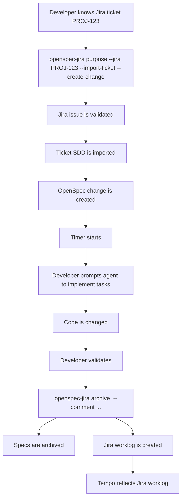

# Jira / Tempo Happy Path Demo

This demo shows the first end-to-end workflow for the `openspec-jira` fork:

1. Developer already knows the Jira ticket key.
2. OpenSpec imports the ticket SDD.
3. OpenSpec creates a change and starts time tracking.
4. The developer/agent implements the change.
5. OpenSpec archives the change.
6. OpenSpec writes the worklog to Jira; Tempo reflects it through Jira worklogs.

Stage 2 will add ticket discovery, where OpenSpec lists tickets assigned to the developer and lets them choose which one to start.

## Run The Sandbox Demo

From this repository, run:

```bash
npm run demo:jira
```

The sandbox demo does not need real Jira credentials. It:

- starts a mock Jira server on localhost;
- configures OpenSpec with temporary Jira credentials under a temporary `XDG_CONFIG_HOME`;
- creates a demo product repository under `demo-output/jira-happy-path/product-repo`;
- imports mock Jira ticket `PROJ-123`;
- creates the OpenSpec change;
- validates the change;
- archives the change;
- prints the mock Jira worklog payload that would have been sent to Jira Cloud;
- prints the mock Jira issue comment that records the OpenSpec archive result.

After it finishes, inspect:

```text
demo-output/jira-happy-path/
├── README.md
├── mock-jira-comments.json
├── mock-jira-worklogs.json
├── config-home/
└── product-repo/
    ├── .openspec/
    └── openspec/
```

Use the rest of this document as the narrated version of the same happy path.

Do not run the placeholder commands in the real-Jira section unless you replace `https://your-company.atlassian.net`, `dev@example.com`, `YOUR_ATLASSIAN_API_TOKEN`, and `PROJ-123` with real values from your Jira instance.

## Preconditions

The developer has installed the fork:

```bash
npm install -g git+ssh://git@github.com/your-org/openspec-jira-tempo.git
```

The fork is invoked as:

```bash
openspec-jira
```

The developer has configured Jira credentials once on their machine:

```bash
openspec-jira config set jira.base_url https://your-company.atlassian.net
openspec-jira config set jira.email dev@example.com
openspec-jira config set jira.api_token YOUR_ATLASSIAN_API_TOKEN
openspec-jira config set worklog.rounding minute
openspec-jira config set worklog.min_seconds 60
```

The developer is inside the product repository where OpenSpec is used:

```bash
cd ~/work/product-repo
```

The Jira ticket is known:

```text
PROJ-123
```

The Jira ticket description contains SDD-like sections such as:

```md
## Context
## Goals
## Acceptance Criteria
## Business Rules
## Domain / Data / Integration Contracts
## UX / Error States
## Out of Scope
```

## Demo Flow



## Step 1: Start From Jira Ticket

The developer starts the work session from the known Jira ticket:

```bash
openspec-jira purpose --jira PROJ-123 --import-ticket --create-change
```

Expected output:

```text
Started OpenSpec session for PROJ-123 at 2026-04-20T10:00:00-03:00
Imported Jira ticket context: PROJ-123 - Carga y persistencia de información general del perfil del Director Técnico
Created OpenSpec change 'proj-123-carga-y-persistencia-de-informacion-general-del' at openspec/changes/proj-123-carga-y-persistencia-de-informacion-general-del/
```

What OpenSpec does:

- Calls Jira `GET /rest/api/3/issue/PROJ-123`.
- Imports `key`, `summary`, `status`, `assignee`, `description_text`, and `url`.
- Parses SDD sections from `description_text`.
- Creates a local OpenSpec change.
- Starts a timer in `.openspec/session.json`.

## Step 2: Inspect Generated OpenSpec Change

Generated files:

```text
openspec/changes/proj-123-carga-y-persistencia-de-informacion-general-del/
├── .openspec.yaml
├── proposal.md
├── tasks.md
├── jira-ticket.md
└── specs/
    └── proj-123-carga-y-persistencia-de-informacion-general-del/
        └── spec.md
```

Important generated content:

- `jira-ticket.md` preserves the imported Jira ticket description.
- `proposal.md` summarizes the Jira source and impact.
- `tasks.md` includes generic implementation tasks plus one task per acceptance criterion.
- `spec.md` converts SDD acceptance criteria into OpenSpec scenarios.

Example generated `spec.md` shape:

```md
## ADDED Requirements

### Requirement: Carga y persistencia de información general del perfil del Director Técnico
The system SHALL implement the behavior specified by Jira issue `PROJ-123`.

Imported context:

...

Imported business rules:

...

#### Scenario: CA-1 - Visualización de campos mínimos requeridos
- **GIVEN** que el Director Técnico ha iniciado sesión
- **WHEN** el sistema carga la sección de información general del perfil
- **THEN** debe permitir ingresar como mínimo los campos `nombre` y `apellido`.

#### Scenario: CA-2 - Guardado exitoso con datos mínimos válidos
- **GIVEN** que ingresa un `nombre` válido
- **AND** ingresa un `apellido` válido
- **WHEN** presiona `Guardar`
- **THEN** el sistema guarda la información general del perfil.
```

## Step 3: Prompt The Agent To Implement

This is where the developer interacts with the agent.

Example prompt:

```text
Lee el change OpenSpec `proj-123-carga-y-persistencia-de-informacion-general-del`.
Implementa las tareas de `tasks.md` siguiendo estrictamente el `spec.md`.
No agregues comportamiento fuera de scope. Al final, ejecuta validaciones y dime qué acceptance criteria quedan cubiertos.
```

The agent should read:

```text
openspec/changes/<change-name>/proposal.md
openspec/changes/<change-name>/tasks.md
openspec/changes/<change-name>/jira-ticket.md
openspec/changes/<change-name>/specs/<change-name>/spec.md
```

Then the agent changes product code and tests.

## Step 4: Validate Locally

The developer validates the OpenSpec change:

```bash
openspec-jira validate proj-123-carga-y-persistencia-de-informacion-general-del --type change
```

Optional status check:

```bash
openspec-jira status --change proj-123-carga-y-persistencia-de-informacion-general-del
```

Expected result:

```text
Validation passed
```

## Step 5: Archive And Write Jira Worklog

The developer archives the completed change:

```bash
openspec-jira archive proj-123-carga-y-persistencia-de-informacion-general-del --yes --comment "Implemented Jira PROJ-123 with OpenSpec"
```

What OpenSpec does:

- Applies delta specs to `openspec/specs/`.
- Moves the change to `openspec/changes/archive/YYYY-MM-DD-<change-name>/`.
- Reads `.openspec/session.json`.
- Calculates elapsed time.
- Rounds time according to config.
- Calls Jira:

```text
POST /rest/api/3/issue/PROJ-123/worklog
```

- Adds a Jira issue comment with the OpenSpec archive summary:

```text
POST /rest/api/3/issue/PROJ-123/comment
```

Expected output:

```text
Change 'proj-123-carga-y-persistencia-de-informacion-general-del' archived as '2026-04-20-proj-123-carga-y-persistencia-de-informacion-general-del'.
Archived OpenSpec session for PROJ-123
Duration: 86m
Jira worklog created successfully: 123456
```

If Tempo Timesheets is installed and configured over Jira worklogs, Tempo reflects the Jira worklog.

## Step 6: Final State

OpenSpec state:

```text
openspec/specs/
openspec/changes/archive/YYYY-MM-DD-proj-123-carga-y-persistencia-de-informacion-general-del/
.openspec/sessions/<timestamp>_PROJ-123.json
```

Jira state:

```text
PROJ-123 has a new worklog
PROJ-123 has an OpenSpec archive summary comment
```

Tempo state:

```text
Tempo reflects the Jira worklog for reporting/timesheets
```

## Failure Handling In The Demo

If Jira worklog creation fails, OpenSpec does not delete the active session. It marks it as pending:

```json
{
  "status": "sync_pending",
  "worklog_status": "pending"
}
```

After fixing credentials or connectivity:

```bash
openspec-jira archive --retry
```

If OpenSpec archive validation fails, the change is not archived and remains open. The active timer is still closed and synced as a Jira worklog because it represents developer time already spent. OpenSpec attempts to add a Jira issue comment with the blocking reason so the ticket keeps a trace of the failed archive attempt.

## Stage 2 Preview

Today the developer provides the ticket key:

```bash
openspec-jira purpose --jira PROJ-123 --import-ticket --create-change
```

Stage 2 will add a ticket selection command:

```bash
openspec-jira tickets assigned
```

Expected future flow:

```text
1. OpenSpec fetches Jira tickets assigned to the developer.
2. Developer selects one.
3. OpenSpec runs the same import/create/timer flow.
```
